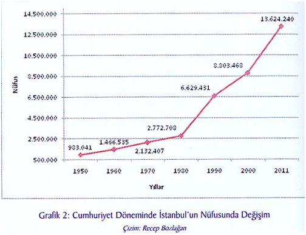

# KENTSEL DÖNÜŞÜM MEVZUATININ HUKUKSAL DEĞERLENDİRMESİ

**Nusret İlker ÇOLAK**

**GİRİŞ**

İnsanların barınma gereksinimi ve bir arada yaşama ihtiyacı, kentsel yerleşimlerin ortaya çıkmasının temel dinamikleridir. İnsanların çevresel faktörlere karşı korunma ve güvenlik sağlama çabaları, barınma mekânlarının hazırlanmasını ve bu mekânların bir arada bulunmasını zorunlu kılmıştır. Barınma mekânlarından oluşan yapılar topluluğunun kendisinden beklenen fonksiyonları karşılayabilmesi için, bir kent düzeninin kurulması gerekmiştir. Bu gereklilik doğrultusunda, şehirleşme için yer seçim aşamasından başlayarak, bir plan doğrultusunda yapılaşma süreci yönetilmektedir.

Planlı bir kentleşmenin sağlanmasına yönelik olarak gerçekleştirilecek planlama faaliyetleri, ayrı bir idari faaliyet olarak idarenin sorumluluk alanına girmiştir[\[1\]](#_ftn1). İdarenin yerine getirmesi gereken bir görev olan imar planlaması; planların hazırlanması, planlar doğrultusunda uygulamanın yönetilmesi ve kurallara aykırı davranışların önlenmesi şeklinde farklı boyutlarda karşımıza çıkmaktadır. İmar planlama ve uygulama sürecinin üç temel amacı bulunmaktadır. Bunlar; düzenli, sağlıklı ve estetik kentleşme olarak ifade edilebilir[\[2\]](#_ftn2). Düzenin sağlanamadığı, sağlıklı bir yapılaşmanın gerçekleştirilemediği ve sanat değerinden yoksun yapılaşmaların hâkim olduğu bir şehirde, idareye verilen imar planlamasını yapma ve uygulamayı yönetme görevinin kendisinden beklenen sonuçları doğurması mümkün olmayacaktır.

İmar planlama sürecinde idare, sahip olduğu sınırlı doğal kaynakları, ihtiyaçlar bakımından en verimli şekilde kullanmak üzere bir çalışma yapacaktır. Eldeki arazi ve doğal kaynakların taşıma kapasitesine göre bir yapılaşma-kullanım yoğunluğunun belirlenmesi ve yapılan teknik-bilimsel analizlerin sonuçlarına göre kullanım fonksiyonlarının tanımlanması gerekir. Özetle idare, imar planlama sürecinde sahip olunan sınırlı doğal kaynakları, kentleşme ihtiyacının karşılanmasına en verimli şekilde kullanmasını sağlamaya çalışmakla yükümlüdür. Sınırlı doğal kaynakların talepler bakımından en etkin şekilde değerlendirme çabalarında; yapılaşma ve barınma ihtiyacının yoğunluğu dikkate alınarak, mümkün olan en kısa sürede planlama sürecinin tamamlanması ve yapılaşmanın idarenin denetimi altında sağlanması gerekir.

İdarenin planlama ve uygulamayı şekillendirme sürecinde yetersiz kalması, konut ihtiyacı başta olmak üzere, toplumun yapılaşma gereksinimlerinin baskılamasıyla, hukuka aykırı yapılaşmalar olarak tanımlanan kaçak ve gecekondu yapılaşmasının ortaya çıkmasına yol açmıştır. Hukuka aykırı yapılaşmalar olarak ortaya çıkan kaçak yapılar ve gecekonduların çıkarılan kanunlarla yasallık kazanmasıyla[\[3\]](#_ftn3), kentleşmenin temel amaçlarından sapması kaçınılmaz bir sonuç olarak ortaya çıkmıştır.

Düzenli, sağlıklı ve estetik kentleşme kriterlerinden ve niteliklerinden yoksun yerleşim yerlerinde, kamusal hizmetler beklentilerin gerisinde kalmış, kamu düzeninin sağlanmasında güçlükler yaşanmış, sanat değerine sahip binalar yapılması ya da şehrin estetik değerlere göre şekillenmesi beklentileri bir hayal olarak kalmıştır. Hukuka aykırı yollarla gerçekleşen yapılaşmalara yönelik olarak imar kolluk yetkileri kullanılarak aykırılıkların giderilmesi yerine çeşitli saiklerle bu yapılara yasallık kazandırılması, kurallara saygılı çoğunluğun cezalandırılması sonucunu doğurmuştur.

Düzensiz, sağlıksız ve estetikten uzak olarak yapılaşmış bir yerleşim yerinin imar planlama ve uygulama faaliyetlerinin temel amaçları doğrultusunda düzeltilmesi, yüksek ekonomik maliyetinin yanında, birçok sosyal sorunu da beraberinde getirmektedir. Şehrin yeniden düzenlenmesi konusunda farklı dönemlerde ortaya konulan iradeler ve çıkarılan yasalar, beklentileri tam olarak karşılayamamıştır. Bu gün gelinen noktada, Türkiye’de kentlerin planlama ve yapılaşma sürecinden kaynaklanan sorunların çözümlenmesinde, afet riskinin oluşturduğu baskı altında, adımlar atılmaya başlanmış, çözüm sürecinin mali kaynakları konusunda yollar aranmış ve sosyal açıdan sorunun çözümü yönünde genel bir kanaat oluşmuştur.

Bu sunumda, bana ayrılan süre içerisinde, kentsel dönüşüm kavramı, kentsel dönüşüme yönelik olarak ortaya konulan çabalar, uygulamaya konulan dönüşüm modellerinin genel incelenmesi yapıldıktan sonra, Afet Riski Altında Bulunan Alanların Dönüştürülmesi Hakkında Kanun çerçevesinde, kenti dönüştürmeye yönelik düzenleme üzerinde görece olarak daha ayrıntılı bir değerlendirme yapılacaktır.

**I-KENTSEL DÖNÜŞÜM KAVRAMI**

Kentsel dönüşüm, ilk bakışta sıcak ve pozitif bir kavram olarak karşımıza çıkmakla birlikte, uygulanma süreci ve etki alanları bakımından birçok hak ve özgürlüğü doğrudan ve derinden etkileme potansiyeline sahiptir.

Kentsel dönüşüm, yerleşime konu olmuş bir alan üzerinde gerçekleştirilecek değişimin adı olarak karşımıza çıkmaktadır. Ekonomik, sosyal veya kamusal gereklilikler bakımından beklentileri karşılamayacak hale geldiği düşünülen alanlarda bir dönüştürme yapılması, bu konuda teşviklerin yanında kimi zorlayıcı tedbirlerin de devreye konulması suretiyle gerçekleştirilecek olması karşısında “dönüşüm” kavramının içeriğine daha dikkatli bakılmasında yarar vardır.

**1-Kentsel Dönüşüm ya da Kenti Dönüştürme Kavramı**

Kentsel dönüşüm uygulamalarının kavramsal boyutunda, 5393 sayılı Belediye Kanununun 73.maddesinde yer alan düzenleme doğrultusunda yapılacak uygulamanın hak ve özgürlükler üzerinde muhtemel olumsuz etkileri dikkate alınarak, daha az sorunlu bir ifade olan “dönüşüm” tercih edilmiştir. Kanunun bu düzenlemesi, kentsel alanlarda yaşanacak dönüşüm ya da dönüştürmenin adı olarak genel kabul görmüştür[\[4\]](#_ftn4).

Dönüşüm, doğal süreçler içerisinde, zorlama olmadan, kendi dinamikleri içerisinde mevcut durumdan bir başka duruma geçişi ifade eder. Dönüşüm, değişimin doğal olarak yaşanmasının adıdır. Belli bir plan ve takvime bağlanmış bir değişimi dönüşüm olarak ifade etmek isabetli olmayacaktır. Dış etkenlerin devreye girdiği, planlı bir şekilde ve hedeflenen şekle ulaşmak üzere oluşturulan bir takvim söz konusu ise bu durumu dönüşüm olarak tanımlamak ne kadar mümkündür?[\[5\]](#_ftn5) Dönüşüm; dış müdahaleler söz konusu edilmeden, en azından zorlama tedbirleri uygulanmadan gerçekleşecek bir iyi yönde değişim olması durumunda, dönüşüm olarak kabul edilebilir.

Kamu gücü kullanılarak, dönüştürülen alanda yerleşik kişilerin başta mülkiyet hakkı olmak üzere, kimi hak ve özgürlükleri baskılanarak ya da rızası dışında ortadan kaldırılarak, bir plan ve takvime göre bir hedef belirlenerek gerçekleştirilecek değişimin adı dönüşüm olamamalıdır. Böyle bir yaklaşım üzerinden gerçekleştirilen kentsel alan yenilenmesinin adı kenti dönüştürme olmalıdır. Yasa koyucu, özellikle zorlayıcı idari tedbirlerle, kentsel alanlarda dönüşüm sağlamak üzere ortaya koyduğu düzenlemelerde kentsel dönüşüm adını kullanmamasına, hatta afet riskinin giderilmesine yönelik yürütülecek idari faaliyetleri düzenleyen Kanunda “dönüştürülme” ifadesi Kanunun ismi olarak açıkça kullanılmasına rağmen[\[6\]](#_ftn6), kentin yenilenmesine yönelik faaliyetlerin genel olarak adının kentsel dönüşüm olarak ifade edilmesi doğru bir yaklaşım değildir. Bu noktada, 5393 sayılı Belediye Kanununun 73.maddesinde tanımlanmış bulunan ve yıpranan bir kentsel alanın dönüştürülmesinde bir model olarak karşımıza çıkan kentsel dönüşüm uygulamasının bütün dönüştürmelerin genel adı olarak kabul edilmesi ve kullanılması kavramsal olarak yerinde olmayan bir tercihtir.

Kentsel dönüşüm ya da kenti dönüştürme uygulamalarının kavramsal boyutunun ortaya konulmasında, dönüşüm ya da dönüştürme uygulamalarına hangi yönden bakıldığı da önemlidir. Sosyolojik açıdan kentsel dönüşüm ya da kenti dönüştürme kavramı farklı bir boyutta karşımıza çıkarken planlama açısından daha farklı bir anlam içerecektir. Kentsel dönüşüm ya da kenti dönüştürme kavramının hukuki boyutunda, sorunlu kentsel mekânların sorunlarının giderilmesi suretiyle daha yaşanılabilir bir ortamın sağlanması anlaşılmaktadır. Hukuki yönüyle dönüşüm ya da dönüştürme, kentin niteliklerinin artırılması ve sorunlarının giderilmesi şeklinde bir kavramsal içeriğe sahiptir. Kentin ya da yapıların sorunlarının giderilmesi ya da niteliklerinin artırılması uygulamasında kamusal güç kullanılarak muhatapların rızası aranmaksızın hak ve özgürlüklerine müdahalede bulunulmakta ve sürece ilişkin giderlerin bir kısmı kamu kaynaklarından karşılanmaktadır. Kamu gücünün etkin olarak kullanıldığı, hak ve özgürlüklere yoğun müdahale imkanı veren ve kamu kaynaklarından finanse edilen bir uygulamanın doğal bir süreç olmadığı ve dönüşümden çok dönüştürme şeklinde ortaya çıktığı açıktır. Bu durumda, kentsel alanların dönüşümünde uygulanan modellerde, iki kavram ortaya çıkmaktadır. Bunlardan birincisi kentsel dönüşüm, ikincisi ise kenti dönüştürme kavramıdır. Bu iki kavramı, kentsel dönüşüm ve kenti dönüştürme olarak birlikte ifade etmek mümkündür.

**2-Kentsel Dönüşüm ya da Kenti Dönüştürme Tanımı**

Kentsel dönüşüm ya da kenti dönüştürme uygulaması, kamu gücünün devreye konulmasıyla gerçekleştirilebilecek bir süreç olarak öngörülmüştür. Çünkü tarihi değerlerin kaybedilmesi ya da depremde yapıların yıkılması riskine bağlı olarak can ve mal güvenliğinin tehdit altında olması, fiziki olarak kent mekânlarının ivedilikle dönüştürülmesini zorunlu hale getirmiştir. Risk oluşturan faktörleri güçlendiren kentsel olumsuzlukların bir an önce ortadan kaldırılması gerekliliği, kenti dönüştürme sürecinde idarenin aktif olarak devreye girmesi sonucuna varmıştır. İdareye verilen kamusal yetkilerin kullanılması suretiyle kentin dönüştürülmesi uygulamasının sınırlarının belirlenmesinde önem taşıyan konulardan biri de kenti dönüştürme kavramının tanımlanmasıdır. Kenti dönüştürme uygulamalarında idarenin sahip olduğu yetkiler, muhataplarının hak ve özgürlükleri üzerinde olumsuz etkiler doğurabilecektir. Hak ve özgürlük alanına yapılacak müdahalenin hukuk sınırları içerisinde kalmasının sağlanması, idarenin faaliyet alanının tanımlanmasıyla yakından ilişkilidir.

Plansız yapılanmış ya da planlı yapılanmakla birlikte zaman içerisinde ekonomik, soysal ve fiziki bakımdan yetersiz hale gelmiş bir kentsel mekânın, taşımakta olduğu risklerin ortadan kaldırılarak güncel ihtiyaçlar doğrultusunda yenilenmesine kenti dönüştürme denir[\[7\]](#_ftn7). Kenti dönüştürme uygulamasında risklerin ortadan kaldırılması ve ihtiyaca cevap verebilirliğin sağlanması ön plana çıkmaktadır.

**II-KENTSEL DÖNÜŞÜM VEYA KENTİ DÖNÜŞTÜRMENİN AMACI VE GEREKÇELERİ**

Kentsel dönüşüm ya da kenti dönüştürme uygulamaları söz konusu olduğunda, dönüşüme konu alanda yapılacak uygulamaların hak ve özgürlükler üzerinde olumsuz etkiler doğurması kaçınılmazdır. Başta mülkiyet hakkı olmak üzere, yerleşme hakkı, konut hakkı ve benzeri haklar yapılacak uygulamadan etkilenecektir[\[8\]](#_ftn8). Kentin dönüştürülmesi sürecinde bireysel hak ve özgürlüklerin uygulamadan etkilenecek olması, yapılacak uygulamanın gerekçelerinin açıkça ortaya konulmasını ve hedeflerinin netleştirilmesini zorunlu hale getirmektedir. Bu zorunluluk doğrultusunda yasa koyucu, idareye kenti dönüştürme konusunda yetki verirken, bu yetkinin hangi gerekçelere dayalı olarak kullanılacağını da açıkça ortaya koymak durumundadır.

**1-Kentsel Dönüşüm ve Kenti Dönüştürme Uygulamalarının Gerekçeleri**

Kenti dönüştürme uygulamaları, kamu gücü kullanılarak kentsel mekânların yenilenmesi faaliyetleri olduğuna göre, kanunlarda yer alan düzenleme gerekçeleri, kimi kentsel alanların neden dönüştürülmesi gerektiği sorusuna verilecek cevaptan yola çıkılarak belirlenebilecektir. Kenti dönüştürme uygulama gereksiniminin ortaya çıkmasının arka planında yer alan sosyo-ekonomik konular, dönüştürmenin bir gereksinim olarak kabul edilmesini sağlamakla birlikte yapılacak uygulamanın birincil gerekçeleri olarak kabul edilemeyecektir. Dönüşüm ya da dönüştürmenin gerekçeleri arasında, can ve mal emniyeti bakımından var olan risklerin önlenmesi, kentsel yaşamda karşımıza çıkan olumsuzların ortadan kaldırılması ve kentsel yaşam kalitesinin artırılmasına yönelik olarak şehrin niteliklerinin artırılması hedefleri ilk bakışta karşımıza çıkan gerekçelerdir.

**A.Fiziki Olumsuzluklar ve Afet Riskinin Önlenmesi**

Kenti dönüştürme konusunda kamusal yetkilerin kullanılmasına yönelik yasal düzenlemeler doğrultusunda hak ve özgürlüklere müdahale edilmesine izin verilmesinin arkasında kentin fiziksel yetersizliğine bağlı olarak afet riskinin can ve mal güvenliği üzerinde oluşturduğu baskı yer almaktadır. Yapılış sürecinde yaşanan denetimsizlikler ya da zaman içinde ortaya çıkan yıpranmalar nedeniyle riskli hale gelmiş yapıların ya da yapılaşma alanının niteliklerinden kaynaklanan riskler nedeniyle tehlikeli hale gelmiş bölgelerin, sahip olduğu tehlikenin bertaraf edilmesine yönelik olarak dönüştürme uygulamasının yapılması idarenin varlık nedeni olan görevler kapsamında bulunmaktadır. Toplum yaşamına yönelmiş tehditlerin ortadan kaldırılması ve güvenliğin sağlanması idareye verilen kolluk yetkilerinin ilk gerekçesini oluşturmaktadır. Kamu düzeninin sağlanmasında güvenlik unsurunun önemine yapılan vurgu, tehlike arz eden yerleşim alanının ya da tek başına tehlikeli hale gelmiş bir yapının riskinin ortadan kaldırılması noktasında kendini gösterecektir.

Tehlike arz eden yapıların ortadan kaldırılması can ve mal emniyeti bakımından güvenliği sağlamaya yönelik bir tedbir olsa dahi, yıkılacak bina ya da alanda yerleşik bulunan kişilerin mağdur olması riskini de beraberinde getirecektir. Bu noktada kanun koyucu, idareye ilave bir sorumluluk yükleyerek, riskin bertaraf edilmesine paralel olarak, yapıların sağlıklaştırılması veya yenilenmesi yönünde uygulamaların da yapılmasını öngörmüştür. 16.5.2012 tarih ve 6306 sayılı Afet Riski Altındaki Alanların Dönüştürülmesi Hakkında Kanunun amaç başlığını taşıyan 1.maddesinde yer alan düzenlemeye bakıldığında, bir bölgenin afet riski altında bulunması ya da tek bir yapının riskli olması durumunda dönüştürülme sürecinin devreye gireceği görülmektedir.

**B.Düzenli, Sağlıklı ve Estetik Kentleşmenin Sağlanması**

Yerleşim alanlarının düzenli, sağlıklı ve estetik olarak şekillendirilmesi imar planlama ve uygulama yetkilerinin temelini oluşturmaktadır. Bu temel doğrultusunda, kentsel alanda 5393 sayılı Belediye Kanununun 73.maddesi kapsamında yapılacak yenilemelerin temel gerekçesi şehrin yapılaşma sürecinde düzenli, sağlıklı ve estetik yapılaşma koşullarının gerçekleştirilememiş ya da sonradan kaybedilmiş olmasıdır. Bu noktada idareler, yapılaşma faaliyetlerini düzenleme ve denetleme yetkisinin temel gerekliliğine ulaşmaya yönelik kentin dönüştürülmesine ilişkin yetkiler kullanacaktır.

**C.Taşınmaz Kültür Varlıklarının Korunması**

Taşınmaz kültür varlıkları, milli kültürün somutlaşmış değerleri olarak korunması gereken yapılardır. Bu yapıların korunmasına yönelik olarak idari teşkilat kurulması ve faaliyetlerde bulunulması 1982 Anayasasının 63.maddesinde Devlete verilmiş olan bir görevdir. Devletin tarihi, kültürel ve doğal varlıkları koruma görevi, sürekli bir idari teşkilat ve görev olarak yerine getirilmekle birlikte, taşınmaz kültür varlıklarının korunmasında kamu gücü kullanılarak belli bir alanda dönüşüm yapılması gerekliliği doğması durumunda, toplu yenilemeler yapılması yasal dayanağa kavuşturulmuştur. 5366 Yıpranan Tarihi ve Kültürel Taşınmaz Varlıkların Yenilenerek Korunması ve Yaşatılarak Kullanılması Hakkında Kanunla idareye verilen yetkinin gerekçesi, sit alanı ilan edilerek, alan ölçeğinde topluca korunmasına karar verilen alanlarda ortaya çıkan sosyal, ekonomik ve mekânsal olumsuzlukların giderilmesi suretiyle taşınmaz kültür varlıklarının korunmasın sağlanmasıdır.

Taşınmaz kültür varlıklarının korunması, milli kültürün şekillenmesinde ve anlaşılmasında etkili olmuş, ulusal ya da evrensel değerlerin korunması anlamına gelmekte olduğundan, tespit ve tescili yapılmış taşınmaz kültür varlıklarının yok olmasının önlenmesi Anayasal bir görevdir. Devlet, bu yasal düzenleme ile, Anayasayla teminat altına alınmış bulunan kültür, tarih ve tabiat varlıklarını koruma bağlamında, sit alanlarında yer alan taşınmaz kültür varlığı yapıların korunması konusunda bütüncül bir yaklaşımla sit alanlarında dönüştürme yapma yoluna gitmektedir.

**2-Kentsel Dönüşüm ve Kenti Dönüştürme Uygulamalarının Amaç ve Hedefleri**

Kenti dönüştürme uygulamalarının gerekçelerine bakıldığında, amaç ve hedeflerinin ne olduğu da anlaşılacaktır. Gerekçede ortaya konulan eksiklik, aksaklık ya da risklerin ortadan kaldırılması suretiyle kamu yararının sağlanması dönüştürme ve dönüşüm uygulamalarının amacını, bahse konu sorunların giderilmesi ise uygulamaların hedeflerini oluşturmaktadır. Bununla birlikte, kentsel dönüşüm ya da kenti dönüştürme faaliyetlerinin hedeflerinin, toplumsal yaşama ve şehre sağlamış olduğu fayda bakımından başlıklandırmak mümkündür. Buna göre;

i.Kent içindeki terk edilmiş çöküntü alanlarının canlandırması suretiyle ekonomik, sosyal ve idari sorunların çözüme kavuşturulması sağlanacaktır.

ii. Kentin sağlıklı ve etkili bir şekilde geliştirilmesi mümkün olacaktır. Şehrin sağlıklı yapılaşamamış olması ya da sonradan bu niteliğinin kaybedilmesi, üstesinden gelinmesi gereken bir sorun olarak karşımıza çıkmakta olduğundan, kentsel dönüşüm ya da kenti dönüştürme uygulamalarında sağlıklı hale getirilme veya etkili bir şekilde geliştirilme hedefler arasında yer alacaktır.

iii. Kent ekonomisinin güçlendirmesi, kentsel dönüşüm ya da dönüştürmenin ekonomik boyutunu ifade etmektedir. Kenti dönüştürme girişimlerinin başarısındaki belirleyici faktör, dönüşümün yeterli ekonomik kaynağa sahip olup olmasıdır.

iv. Kentsel yaşam kalitesinin ve toplumda yaşam tatmininin artırılması sağlanmaktadır. Kent yaşamının insanları mutlu etmesi, beklentilere ve standartlara uygun bir yapılanmanın hâkim olmasıyla mümkün olacaktır[\[9\]](#_ftn9).

**III-KENTSEL DÖNÜŞÜM VE KENTİ DÖNÜŞTÜRME MODELLERİ**

Yerleşik bir alanın ihtiyaçlara cevap veremez hale gelmesi durumunda, çözüm üretilmesi gerekir. Böyle bir durumda, ihtiyaçları dikkate alan kentsel dönüşüm ya da kenti dönüştürme uygulamaları karşımıza çıkar. Kentsel mekânların dönüşümü ya da dönüştürülmesine yönelik olarak çeşitli alternatifler ortaya konulabilir ve hedeflenen sonuçlara ulaşılabilir. Sorunlu bir kentin ya da kent mekânının dönüştürülmesi söz konusu olduğunda, dönüşüm ihtiyacı duyulan alan ya da yapıların niteliklerine, konumuna, dönüşme ihtiyacının yoğunluğuna ve aciliyetine bağlı olarak dönüşüm ya da dönüştürme modelleri oluşturulabilecektir.

Kentsel dönüşüm ya da kenti dönüştürme uygulamalarında hangi modelin uygulanacağına karar verme sürecinde; dönüşüm ihtiyacı, dönüşecek alanın ya da yapının nitelikleri ve durumun aciliyeti belirleyici olmakla birlikte, modeli belirleme işi bir siyasi tercih olarak ortaya çıkacaktır. Kentsel dönüşüm ya da kenti dönüştürme uygulamalarının hak ve özgürlüklerle olan ilgisi bu konuda yasal düzenleme yapılmasını gerektirmektedir. Bir başka ifadeyle, mülkiyet hakkı, konut hakkı, yerleşme özgürlüğü, girişim özgürlüğü gibi birçok hak ve özgürlüğü doğrudan etkileyecek olan kentsel dönüşüm ya da dönüştürme konusunda uygulanacak yöntemin belirlenmesi siyasi iradenin tercihleri doğrultusunda bir yasama iradesi olarak ortaya çıkacaktır.

**1-Kenti Dönüştürme ya da Kentsel Dönüşüm Modelleri[**\[10\]**](#_ftn10)**

Eskiyen, yıpranan, çöküntü alanı haline gelen, şehir yaşamının gerektirdiği fiziksel ve mekânsal ihtiyaçlara cevap veremez hale gelen kent kısımlarının dönüştürülmesinde yasa koyucu yöntem belirlerken, alanın niteliklerine, sorunun büyüklüğüne, dönüştürme maliyetinin büyüklüğü, kaynak finansmanı ve benzeri konulara bakarak tercihini ortaya koyacaktır.

Türkiye’de kentsel dönüşüm ya da kenti dönüştürme konusunda sosyal hayatta yaşanan değişime paralel olarak, kent bütünlüğünde ya da kentin belli kısımlarında dönüşüm sağlanarak yaşam kalitesinin artırılması hedeflenmektedir. Kentsel dönüşüm ya da kenti dönüştürme süreçlerinin hukuki boyutunda, kentsel mekânların iyileştirilmesi ve kent yaşamının sorunlarının çözümlenmesi amacıyla hep iyileştirmeye yönelik düzenlemeler karşımıza çıkmaktadır. Kentsel dönüşüm ya da kenti dönüştürme uygulamalarına yönelik yasal düzenlemelerde kent yaşamını iyileştirmek suretiyle kamu yararını gerçekleştirme hedefi egemendir. Hukuki boyutu itibariyle kentsel dönüşüm ya da kenti dönüştürme, değişimin pozitif olarak gerçekleştirilmesini ifade etmektedir. Kanun koyucu, kentin dönüşmesi ihtiyacı doğrultusunda zamana, şartlara ve siyasi tercihlerine bağlı olarak çeşitli dönüşüm ya da dönüştürme modelleri öngörmüştür

**A. Gecekondu Kanunu Uygulaması**

Gecekondulaşma, Türkiye’de kent sorunlarının temelini oluşturan kontrolsüz ve altyapısız yapılaşmanın adıdır[\[11\]](#_ftn11). Yetkili idarelerden izin alınmaksızın, onaylı projesi ya da inşaat ruhsatı olmadan, çoğunlukla kamu arazisi üzerinde tamamen hukuk dışı bir şekilde ortaya çıkan yerleşimler, kent sorunlarına kaynaklık etmiş ve etmektedir.

Gecekondulaşma, konut ihtiyacıyla konut arzı arasında makul bir miktar ve fiyat dengesi oluşturulamadığından dolayı ortaya çıkmış sosyolojik boyutlu bir sorundur. Kırsal alanlardan kentlere yönelmiş aşırı boyutta göçler nedeniyle konut ihtiyacının imara ilişkin yasalara uygun şekilde karşılanması mümkün olmamıştır. Sosyolojik sorunların tetiklediği göç hareketleri, kamusal araziler üzerinde, tamamen kontrol dışı bir yapılaşma sürecini doğurmuş ve kentlerde gecekondu bölgeleri ortaya çıkmıştır.

20.07.1966 tarih ve 775 sayılı Gecekondu Kanunu, kentlerde gecekondulaşmanın önlenmesi ve var olanların ıslah ve tasfiyesini amaçlayan bir kanun olarak ortaya çıkmıştır. Kanuni düzenlemenin ortaya çıktığı tarihte henüz ülkenin ciddi boyutlara ulaşmış bir gecekondu sorunu bulunmadığı dikkate alındığında, Kanunda yer alan sadece önleme fonksiyonu gerçekleştirilebilmiş olsaydı, bu gün karşımızda duran sorunlar çok daha küçük ölçekli olurdu.

Gecekondu Kanunu uygulamasında üç temel hedef ortaya konulmaktadır. Bu hedefler; yeni gecekondulaşmaya izin verilmemesi, var olan gecekonduların tasfiyesi ve ıslah edilmesi mümkün olan alanların korunması suretiyle dönüşümün sağlanması şeklinde özetlenebilir. Gecekondu Kanunu uygulamasına bakıldığında, idarenin ortaya koyduğu dönüştürme iradesinin kenti dönüştürme esasına göre şekillendirildiği görülecektir.

**B. Tapu Tahsis Verilmesi Yoluyla Dönüşüm Uygulaması**

Hukuka aykırı yapılaşmaların, özellikle de gecekondulaşmanın ortaya çıkardığı sorunların ortadan kaldırılmasına yönelik olarak; geri dönüşüm imkânlarının ortadan kalktığı yönündeki siyasi kanaatin neticesinde, kamu arazilerinde yerleşmiş kişilere bu alanlarda mülkiyet hakkı verilmesi suretiyle çözüm getirilmek istenilmiştir. Gecekondulaşmış alanlarda, gecekondu sahiplerine 400 m2’ye kadar arazi tapusu vaad eden tapu tahsis belgeleri verilmiş ve bu tapu tahsis belgeleri, ıslah imar planları ya da kadastro planları yapıldıktan sonra tapuya dönüştürülmüştür. 24.02.1984 tarih ve 2981 sayılı İmar ve Gecekondu Mevzuatına Aykırı Yapılara Uygulanacak Bazı İşlemler ve 6785 Sayılı İmar Kanunun Bir Maddesinin Değiştirilmesi Hakkında Kanun ile tapu tahsis belgesi düzenlenmesi ve ıslah imar planı yapılması suretiyle kentsel alanda dönüşüm yapılması hükme bağlanmıştı. Bu Kanun gecekondu yerleşimine konu kentsel alanların dönüşümünde önemli bir düzenleme olarak karşımıza çıkmıştır[\[12\]](#_ftn12). 2981 sayılı Kanun, 16.05.2012 tarih ve 6306 sayılı Afet Riski Altındaki Alanların Dönüştürülmesi Hakkında Kanunun 23. maddesiyle yürürlükten kaldırılıncaya kadar uygulamada kalmıştır. Bu süreçte gecekondu oluşumlarının en azından altyapıya ilişkin sorunlarının çözümlenmesi ve bu yolla kentsel dönüşüm sağlanması hedeflenmiştir.

Gecekondulaşmış kent kısımlarının dönüştürülmesine yönelik tapu tahsis belgesi verilmek suretiyle kamu arazilerini ele geçirenlere sunulan ve siyasal bir yaklaşımın sonucu olan mülkiyete sahip olma hakkı, kamusal alanlarda izinsiz yapılaşmaya gidenlere ve hukuku ihlal edenlere bir ödül olarak görülebilir. Bununla birlikte, arazilerin kısmi olarak bedelinin alınması, tapu tahsise konu edilebilecek arazinin sınırının 400 m2 olarak sınırlanması ve planlama yoluyla dönüşüm sağlanmadan tapu verilmeyecek olması gibi temel ilkeleri nedeniyle bu uygulamanın önemli bir dönüştürme girişimi olduğunu kabul etmek gerekir. Gecekondu alanlarının dönüşümünde önemli bir girişim olmakla birlikte, tapu tahsis düzenlenmesi suretiyle yapılmak istenen dönüşümün gerçekleşme sürecinin uzaması ve ıslah imar planları ya da kadastro planları yapılarak altyapı sorunlarının giderilmesine yönelik işlemlerin ilgili idareler tarafından zamanında gerçekleştirilememesi, Kanundan beklenen yararın tam olarak ortaya çıkmasını engellemiştir.

2981 sayılı Kanun 18 yıl yürürlükte kalmış olmasına rağmen; hala ıslah imar planları ya da kadastro planları ve tapuya dönüştürme işlemi tamamlanmamış tapu tahsis belgelerinin varlığı karşısında, yasa koyucunun iradesinin yerel idareler tarafından tam olarak kabullenilmemiş olduğu sonucunu çıkarmak mümkündür. Tapu tahsis belgesi düzenlenmek suretiyle gecekonduda yaşayanlara bir hak veren, sosyolojik olarak sorunlara yol açmayan bir dönüşüm fırsatı, idarelerin görevlerini yapma konusunda isteksiz davranmasına bağlı olarak etkin ve verimli değerlendirilememiştir. Gereği gibi değerlendirilmeyen bu fırsat, sonrasında daha büyük sorunlar olarak topluma daha ağır maliyetler getirmiş ve yeni dönüşüm ya da dönüştürme modelleri arayışını ortaya çıkarmıştır.

**C.Kentsel Dönüşüm ve Gelişim Uygulaması**

Kentsel dönüşüm ya da dönüştürme uygulamasında yapılan çalışmalara genel olarak isim olmuş olan yöntem, kentsel dönüşüm uygulamasıdır. Kentsel dönüşüm uygulaması modeli, yerel yönetimlerin şehirlerde yapacakları iyileştirme çabaları olarak karşımıza çıkar. 5393 sayılı Belediye Kanunu, belediyelerinin görev bölgelerinde ortaya çıkan kentsel sorunlara çözüm üretmekle görevli olduklarını işaret ederek, bu görevlerin yerine getirilmesine yönelik yetki ve usulleri düzenlemiştir. Belediyelerin görev alanındaki beldeye karşı yerine getirmeleri gereken görevler arasında; kentin düzenli, sağlıklı ve estetik şekilde yapılaşması ve varsa aykırı durumların giderilmesi görevi de yer almaktadır. Bu bağlamda, Belediye Kanununun 73.maddesinde, Kentsel Dönüşüm ve Gelişim Alanı Başlığı altında 18 fıkra halinde kentsel dönüşüm uygulaması düzenlenmiştir.

Kentsel dönüşüm uygulaması, kentsel dönüşüm ve gelişim projesi hazırlanmak suretiyle gerçekleştirilecektir. Kentsel dönüşüm ve gelişim projesi hazırlama konusunda belediyelerin bir takdir hakkı bulunmaktadır. Büyükşehir sınırları içerisinde kentsel dönüşüm ve gelişim projesi uygulama yetkisi büyükşehir belediyelerine aittir. Büyükşehir dışındaki belediyeler görev alanlarında kentsel dönüşüm ve gelişim projesi uygulama yetkisine sahiptir. Büyükşehir sınırları içerisinde kalan ilçe belediyelerinin kentsel dönüşüm ve gelişim projesi uygulama yetkisi, ancak büyükşehir belediyesi meclisinin bu konuda yetki vermesi durumunda söz konusu olabilecektir.

Kentsel dönüşüm ve gelişim projesi uygulamasında kamu mülkiyetinde bulunan araziler esas alınacaksa, Çevre ve Şehircilik Bakanlığı aracılığıyla Bakanlar Kurulu Kararı alınması gerekmektedir. Kentsel dönüşüm ve gelişim projesi en az 5 en çok 500 hektarlık bir arazi üzerinde yapılabilecektir. Bir başka ifadeyle kentsel dönüşüm ve gelişim projesi alansal büyüklük olarak birkaç adadan ibaret olarak uygulanabileceği gibi bütün bir ilçeyi ya da şehri kapsayacak şekilde de uygulanabilir.

Kentsel dönüşüm ve gelişim projesinde, yürürlükten kaldırılmış olan 2981 sayılı Kanun kapsamında hak sahibi olan kişilerin haklarının korunması gerekliliği Belediye Kanununun 73.maddesinde açıkça düzenlenmiştir. Kanunda yer alan bu düzenlemeyi, tapu tahsis belgesi sahiplerinin haklarının kentsel dönüşüm ve gelişim projesi kapsamında korunacağı şeklinde anlamak gerekir. Tapu tahsis belgelerinin tapuya dönüşmüş olması durumunda tapu maliki olan kişilerin bu haklarının korunacağına ilişkin ayrıca vurgu yapmaya gerek bulunmamaktadır. Bu durumda, tapu tahsis belgesi sahibi kişiler, 2981 sayılı Kanun yürürlükten kalkmış olsa dahi, var olan tahsis belgesinden doğan haklarını, özellikle kentsel dönüşüm ve gelişim projesi kapsamında kullanmaya devam edeceklerdir.

**D.Yenileme Alanı Uygulaması**

Yenileme alanı uygulaması, 16.6.2005 tarih ve 5366 Sayılı Yıpranan Tarihi ve Kültürel Taşınmaz Varlıkların Yenilenerek Korunması ve Yaşatılarak Kullanılması Hakkında Kanunla gündeme gelmiştir. Kanun koyucu düzenlemenin amacını belirlerken yenileme alanına ilişkin ipuçlarını da ortaya koymuştur. Kanunda yer alan düzenlemeye göre; “Kanunun amacı, büyükşehir belediyeleri, büyükşehir belediyeleri sınırları içindeki ilçe ve ilk kademe belediyeleri, il, ilçe belediyeleri ve nüfusu 50.000’in üzerindeki belediyelerce ve bu belediyelerin yetki alanı dışında il özel idarelerince, yıpranan ve özelliğini kaybetmeye yüz tutmuş; kültür ve tabiat varlıklarını koruma kurullarınca sit alanı olarak tescil ve ilan edilen bölgeler ile bu bölgelere ait koruma alanlarının, bölgenin gelişimine uygun olarak yeniden inşa ve restore edilerek, bu bölgelerde konut, ticaret, kültür, turizm ve sosyal donatı alanları oluşturulması, tabiî afet risklerine karşı tedbirler alınması, tarihi ve kültürel taşınmaz varlıkların yenilenerek korunması ve yaşatılarak kullanılmasıdır.

Yenileme alanı ilan edilmesine ilişkin idari uygulamaların temel dayanağını oluşturan bu düzenlemenin, sit alanı ilan gerekçesi ve sit alanlarında koruma öncelikleriyle ne kadar bağdaşmakta olduğu konusunda tereddüt doğması kaçınılmazdır. Sit alanının yeniden inşa edilmesinden bahseden bir uygulamanın, ağırlıklı olarak kentsel sit alanlarında uygulamaya konulduğu gerçeği karşısında, yenileme alanının kentsel sit alanı tanımlamasıyla uyumlu hale getirilmesi güçlüğü açıkça görülür[\[13\]](#_ftn13).

Yenileme alanı ilan edilen bölgelerde gerçekleştirilecek uygulamalara ilişkin tanımlar 5366 sayılı Kanunda yer almamakla birlikte, Kanunun uygulamasını gösteren, Yıpranan Tarihi ve Kültürel Taşınmaz Varlıkların Yenilenerek Korunması ve Yaşatılarak Kullanılması Hakkında Kanunun Uygulama Yönetmeliğinde yenileme alanı, yenileme projesi ve benzeri kavramlar açıklanmıştır. Yönetmelikte yer alan tanımlamaların bir kısmı sadece yenileme alanı uygulamalarına ilişkindir.

**a.Yenileme Alanı**

Yenileme alanı, 5366 sayılı Kanun hükümleri doğrultusunda bir sit alanının ve koruma alanının bütünlük içerisinde, koruma önceliklerine göre, restore edilmesini önceleyen bir kavramdır. Yönetmelikte yer alan düzenlemeye göre; “Yenileme alanı: Sit ve koruma alanı olarak tescil ve ilan edilen bölgeler ile bu bölgelere ait koruma alanlarının içinde, sınırları yetkili idarenin teklifi üzerine Bakanlar Kurulu’nca kabul edilerek belirlenen alanlardır”(TKTVYKYKHKUY m.4/f). Yönetmelikte getirilen tanımlama, yenileme alanının içeriğinden çok, alanın hukuki statüsünü belirlemeye yönelik bir tanımlamadır. Yenileme alanının nasıl belirleneceği, kim tarafından belirleneceği gibi konuları dikkate alan bir tanımlama getirilmiştir.

**b.Yenileme Avan Projesi**

Avan projesi, yapılacak bir uygulamanın temel esaslarının ne olması gerektiğini ortaya koyan, ihtiyaçlara göre değişiklikler yapılabilecek fikri çalışmayı ifade eder. Yenileme alanı uygulamalarında avan projesi, sürecin doğru yönlendirilmesi için getirilmiş bulunan bir düzenlemedir. Yıpranan Tarihi ve Kültürel Taşınmaz Varlıkların Yenilenerek Korunması ve Yaşatılarak Kullanılması Hakkında Kanunun Uygulama Yönetmeliğinde yer alan tanımlamaya göre; “Yenileme avan projesi: Yenileme uygulama projelerine esas teşkil edecek, Kanunun 2 nci maddesi uyarınca kültür ve tabiat varlıklarını koruma kurulunca karara bağlanan, mimari avan proje ile statik, tesisat, elektrik, ulaşım ve alt yapı ön raporlarını” içerir(m.4/g). Genel olarak Yönetmelikte yer alan diğer tanımlamalar gibi, yenileme avan projesi tanımlaması da, bir tanımlamadan çok avan projesinin ne olduğunu içerik olarak ortaya koyan bir tanımlamadır. Buna göre avan projesi; “kültür varlıklarını koruma kurulunca karara bağlanan, rölöve, restitüsyon, restorasyon projeleri ile onarılacak veya yeniden inşa edilecek yapıların, imar mevzuatında öngörülen kentsel tasarım, çevre düzenleme, mimari, statik, mekânik-elektrik tesisat ve alt yapı projelerini” ifade eder.

**c.Yenileme Uygulama Projesi**

Yıpranan Tarihi ve Kültürel Taşınmaz Varlıkların Yenilenerek Korunması ve Yaşatılarak Kullanılması Hakkında Kanunun Uygulama Yönetmeliğinde yer alan tanımlamalar içerisinde, yenileme uygulama projesi kavramı da yer alır. Yönetmelik düzenlemesine göre; “Yenileme uygulama projesi: Yenileme alanı içerisinde bulunan tarihi ve kültürel taşınmaz varlıkların, Kanunun 3 üncü maddesi uyarınca kültür varlıklarını koruma bölge kurulunca karara bağlanan, rölöve, restitüsyon, restorasyon projeleri ile onarılacak veya yeniden inşa edilecek yapıların, imar mevzuatında öngörülen kentsel tasarım, çevre düzenleme, mimari, statik, mekanik-elektrik tesisat ve alt yapı projelerini” ifade eder (m.4/h).

**E.Afet Riskinin Önlenmesine Yönelik Dönüştürme Uygulaması**

Afet riski, deprem ülkesi olan Türkiye’nin temel şehirleşme sorunlarından biridir. Depremlerde yaşanan can ve mal kayıpları, yapılaşma sürecinin planlamadan başlayarak iskân izninin alındığı ana kadar denetlenmesi zorunluluğunu doğurmuştur. Yeni yapılaşma sürecinin yakından takip edilmesine ek olarak, mevcut yapı stoklarının ve yerleşik kent kısımlarının dönüştürülmesi gerekliliği ortaya çıkmıştır. Afet riskinin önlenmesine yönelik olarak, kanun koyucu idareyi gerekli yetkilerle donatan bir düzenleme getirerek süreci hızlandırmak istemiştir. Afet riski olarak özellikle deprem riskinin büyüklüğü, yasa koyucuyu temel hak ve özgürlükleri çarpıcı biçimde sınırlandıran bir düzenleme yapmaya itmiştir.

16.05.2012 tarih ve 6306 sayılı Afet Riski Altındaki Alanların Dönüştürülmesi Hakkında Kanun, idareye riskli alanlarda ya da risk taşıyan yapılarda kamu gücü kullanılarak bir dönüşümün zorlanması imkânı sağlamıştır. Zorlama tedbirleri içermesinden dolayı Kanunun adı içerisinde dönüştürme kavramı yer almaktadır. 6306 sayılı Kanundan önce çıkarılmış çeşitli düzenlemelerde kentsel dönüşümün sağlanmasına yönelik olarak tabii seyir içerisinde sonuç alınması istenilmişse de beklenen düzeyde bir iyileşme sağlanamamıştır. Bu noktada kanun koyucu, kentin dönüştürülmesi yönünde muhatapların zorlanmasını ve hedefe ulaşılmasını esas alan bir yaklaşımla düzenleme yapma yoluna gitmiştir.

6306 sayılı Kanun, afet riskinin önlenebilmesi için Çevre ve Şehircilik Bakanlığını, Toplu Konut İdaresini, büyükşehirlerde büyükşehir belediyelerini, büyükşehirler dışında belediyeleri ve il özel idarelerini; afet riski altındaki alanların ve riskli yapıların taşımakta oldukları tehlikelerin giderilmesinde ve bu alan ya da yapıda yaşamakta olan kişilerin mağduriyeti azaltılarak ya da önlenerek dönüştürmenin gerçekleştirilmesinde yetkilendirmiştir.

Afet riskinin önlenebilmesi için alınması gereken tedbirler konusunda 6306 sayılı Kanunda düzenlenmiş bulunan tedbirler, başta mülkiyet hakkı olmak üzere, muhatapların hukuki durumları üzerinde kalıcı tesirlere sahiptir. Kentsel dönüşüm ya da kenti dönüştürme yetkilerinin kullanılmasında, bazı kişilerin yararına gayrı menkul mülkiyetinin el değiştirmesi gibi bir sonucun hedeflenmiş olduğu yönünde toplumda bir algının oluşması son derece tehlikelidir. Afet riski altındaki alanların ya da riskli yapıların dönüştürülmesi sürecinde maliklerin rızası dışında uygulama yapılabilecek olması, iyi niyetle ve can ve mal güvenliği açısından ciddi riskler taşıyan bir konuda ortaya konulacak uygulamaların hassasiyetle sorgulanmasına yol açmaktadır.

**2-Kenti Dönüştürme ya da Kentsel Dönüşümde Uygulama Şekilleri**

Kenti dönüştürme sürecinde ortaya koyulacak uygulamalar, dönüşüm ya da dönüştürme modelleri kadar önemlidir. Dönüşüm ya da dönüştürmeye konu kent kısımlarının ya da yapıların dönüştürülmesinde yapılacak müdahale, ihtiyaca göre şekillendirilmelidir. Müdahale ihtiyacının belirlenmesine yönelik olarak, sorunun ne olduğunun belirlenmesi, hedeflenen iyileştirmenin niteliği, müdahalenin aciliyeti, müdahale yapılacak alanın ya da yapının konumu ve öznel nitelikleri dikkate alınarak müdahale tarzı belirlenmelidir.

**A.Sağlıklaştırma**

Sağlıklaştırma, riskli bir kentsel mekânın ya da yapının sorunlarının giderilmesine yönelik olarak yapı ya da belirli bir mekan ölçeğinde sorunlara çözüm üretilmesi olarak karşımıza çıkar. Sağlıklaştırma, tek yapı ya da toplu olarak uygulanma imkânı olan bir müdahale tarzıdır. Yapılacak bu müdahalede müdahalenin sınırlarının, yönteminin ve kullanılacak malzemelerin tanımlandığı projelerin esas alındığı, izinli bir faaliyet olarak yapılması gerektiğinde tereddüt yoktur.

**B.Yeniden Yapma**

Yeniden yapma, riskli olan bir yapının yıkılarak/sökülerek yeniden yapılmasını ifade eder. Rekonstrüksiyon olarak da ifade edilebilecek bu müdahale tarzında, yapının sorunlarının sağlıklaştırma suretiyle giderilmesinin mümkün olmaması nedeniyle güncel teknolojiyle yeniden yapılması yoluna gidilir. Yeniden yapma sürecinde, yapının yıkılmasında ve yeniden yapılmasında projelendirmelere gidilmesi ve ilgili idarelerden izin alınması zorunludur.

**C.Kentsel Yenileme**

Kentsel yenileme, sorunlu alanlara büyük ölçekli yapılan müdahalenin adıdır. Sağlıklaştırmanın ve yeniden yapmanın iç içe geçmiş olduğu bir uygulama yapılarak kentsel mekânların sorunlarının giderilmesi yoluna gidilir. Kentsel yenilemeler, geniş kapsamlı projelendirmeler kapsamında yapılır. Kentsel yenilemeler şeklinde gerçekleştirilecek dönüşümler dönüştürme olarak karşımıza çıkar. Kentsel yenilemelerde kamusal güç kullanımı ve kamusal katkılar belirgindir.

**IV-KENTSEL DÖNÜŞÜM/DÖNÜŞTÜRME MODELLERİNİN GENEL DEĞERLENDİRMESİ**

Kentin kuruluş sürecinde yaşanan planlama aksaklıkları, yapılaşma sürecinde yaşanan denetim eksiklikleri ya da tamamen plansız ve kontrolsüz yapılaşmalardan doğan sorunlar nedeniyle, kentlerin yaşanabilirlik ve ihtiyaca cevap verebilirlik seviyesi düşmektedir. Kuruluş aşaması sorunlu olan bir kentin kendinden beklenen faydaları sağlaması mümkün olmayacaktır. Kuruluşundan sorunlu olan ya da zaman içerisinde sorunlu hale gelen kentsel alanların ya da yapıların düzenli, sağlıklı ve estetik şehirleşmenin gereği doğrultusunda dönüşmesine yönelik modellerin uygulanması sürecinde, hak ve özgürlüklerin korunması gereklerine göre hareket edilmesi bir zorunluluktur. Bu zorunluluk, kentin dönüşümünün sağlanmasının gerekçeleri ve amaçlarıyla etkilenecek hak ve özgürlükler arasında makul bir denge kurulmasını gerektirir. Kentin dönüşümünün sağlanmasına yönelik faaliyetlerde, etkilenecek hak ve özgürlükleri dikkate almayan bir yaklaşımın hukuka uygunluğunu söylemek mümkün olmayacaktır.

Kentin dönüşümünün sağlanması sürecinde idarenin sahip olduğu yetkilerin hukuki sınırlarının belirlenmesi, hak ve özgürlüklerin korunması gerekleriyle bağdaştırılması ve toplumsal algıda memnuniyet oluşturması gerekir. Bu bakış açısından kentin dönüşümünü sağlayacak modellerin genel olarak ele alınması ve sonrasında, güncel ve etkin bir müdahale yöntemi olarak afet riski altındaki alanların dönüştürülmesi uygulamasının etraflıca ele alınması yerinde olacaktır.

1.  **1.**      **Gecekondu Alanlarının Islah ve Tasfiyesi**

Gecekondu alanlarının ıslah ve tasfiyesine yönelik uygulama, 1960’lı yıllarda ortaya çıkmaya başlayan gecekondulaşma faaliyetlerinin önlenmesi bakımından zamanında gerçekleştirilmiş bir yasal düzenlemedir. Ancak, Kanun doğrultusunda gerçekleştirilmesi gereken uygulamalar, özellikle de önleme faaliyetleri, idareler tarafından yerine getirilemediğinden dolayı, gecekondulaşmanın önüne geçilememiştir. Gecekondulaşmanın önüne geçemeyen bir idare ve bu yönde ortaya konulmayan irade söz konusu iken, gecekondulardan oluşan kentsel alanların ıslah ve tasfiye yoluyla dönüştürülmesini beklemek de gerçekçi olmayacaktır. Nitekim, yeni gecekonduları önleyemeyen ya da önlemeyen yerel yönetimler, var olan gecekondu alanlarının dönüşümü konusunda da etkili bir çalışma yapamamışlardır. Gecekondu Kanununun etkin bir şekilde uygulanamamasının arka planında kentlerin nüfus artış hızı etkili olmuştur[\[14\]](#_ftn14). Öte yandan yerel yöneticilerin gecekondu bölgelerinden gelecek toplu oylar için bu uygulamaları bilerek yapmama tercihleri de bir başka nedendir.

**2.Tapu Tahsis Uygulaması**

Tapu tahsis belgesi verilmek suretiyle kamusal araziler üzerinde ortaya çıkan gecekondu bölgelerinin dönüştürülmesi, gecekondulaşmanın ortaya çıkardığı sorunların ortadan kaldırılmasına yönelik geri dönüşüm imkânlarının ortadan kalkmış olduğuna yönelik olarak ortaya çıkan siyasi kanaatin neticesinde bulunan bir çözümdür. Gecekondulaşma sorunlarının dönüştürülme suretiyle çözülmesine yönelik arayışların sonucunda, kamu arazilerinde yerleşmiş kişilere bu alanlarda mülkiyet hakkı verilmesi suretiyle çözüm getirilmek istenilmiştir. Toplumun siyasi desteğini alma saikiyle yapıldığı yönünde eleştiriler almış olsa da, tapu tahsis belgeleri verilmek suretiyle gecekondu alanlarının planlamaya tabi tutulması ve dönüşümünün sağlanması önemli bir adımdır. Kentlerin gecekondulaşma sorunlarının ivmelenmeye başladığı bir dönemde başarılı bir şekilde sonuca ulaştırılabilseydi, bu gün burada tartışılan sorunlu kentsel alanlar, en azından miktar olarak, daha küçük alanlar olurdu.

Gecekondulaşmış alanlarda, gecekondu sahiplerine 400 m2’ye kadar arazi tapusu verilmeyi vaad eden tapu tahsis belgelerinin verilmesi ve bu tapu tahsis belgelerinin ıslah imar planları ya da kadastro planları yapıldıktan sonra tapuya dönüştürülmesi çözümün çerçevesini oluşturmaktaydı. 24.02.1984 tarih ve 2981 sayılı İmar ve Gecekondu Mevzuatına Aykırı Yapılara Uygulanacak Bazı İşlemler ve 6785 Sayılı İmar Kanunun Bir Maddesinin Değiştirilmesi Hakkında Kanunda tapu tahsis belgesi düzenlenmesi ve ıslah imar planı yapılması suretiyle kentsel alanda dönüşüm yapılması hükme bağlanmıştı. Bu Kanun gecekondu yerleşimine konu kentsel alanların dönüşümünde önemli bir dönüm noktası olarak kabul edilmesi gereken bir düzenleme olarak karşımıza çıkmıştır[\[15\]](#_ftn15). 2981 sayılı Kanun, 16.05.2012 tarih ve 6306 sayılı Afet Riski Altındaki Alanların Dönüştürülmesi Hakkında Kanunun 23.maddesiyle yürürlükten kaldırılıncaya kadar uygulamada kalmıştır. Bu süreçte gecekondu oluşumlarının en azından altyapıya ilişkin sorunlarının çözümlenmesi suretiyle kentsel dönüşüm sağlanması yolunda çabalar ortaya konulmuştur. Yerel idarelerin, Gecekondu Kanunu ve tapu tahsis uygulamalarından doğan görevlerini yerine getirme konusunda isteksiz davranmaları ve kişilerin yeni kanuni düzenlemelerle yeni haklar verileceği beklentisi, gecekondulaşmayı faaliyetlerinin sürmesine neden  olmuştur.

**3.Kentsel Dönüşüm Uygulaması**

Kentsel dönüşüm uygulaması, 3.7.2005 tarih ve 5393 sayılı Belediye Kanununun 73.maddesinde düzenlenmiş bulunan bir dönüşüm modelidir. Büyükşehirlerde büyükşehir belediyelerinin, büyükşehir dışında ise belediyelerin alacakları meclis kararlarıyla gerçekleştirecekleri bir uygulamadır. Kentsel dönüşüm uygulamasının kendi dinamikleri içerisinde, maliklerin katılımı sağlanarak gerçekleştirilecek bir uygulama olduğu ve yaşanabilir şehirler ortaya çıkaracağı açıktır. Yapılacak olan uygulamanın kapsamı ve önemi dikkate alınarak ayrı bir kanuni düzenleme şeklinde ortaya konulması, uygulamanın detaylandırılması ve uygulanma usullerinin belirlenmesi başarıyı artıracaktır. Belirsiz bırakılan ve mülkiyet hakkını doğrudan ilgilendiren uygulama sürecinin belirginleştirilmesi hukuki açıdan bir gerekliliktir. Ancak “kentin tarihi ve kültürel dokusunu korumak” ve “deprem riskine karşı tedbirler almak” kavramları Belediye Kanununda da bulunduğundan; 6306 sayılı Kanunun ve 5366 sayılı Kanunun belediyelerde uygulanması açısından bir öncelik sorunu ve karmaşa yaratmaktadır.

**4.Yenileme Alanı Uygulaması**

Yenileme alanı uygulaması, 16.6.2005 tarih ve 5366 sayılı Yıpranan Tarihi ve Kültürel Taşınmaz Varlıkların Yenilenerek Korunması ve Yaşatılarak Kullanılması Hakkında Kanunda düzenlenmiş bulunmaktadır.

**A.Yenileme Alanı İlan Edilmesinin Amacı**

Kanunun 1.maddesi düzenlenmesine göre; _“yıpranan ve özelliğini kaybetmeye yüz tutmuş; kültür ve tabiat varlıklarını koruma kurullarınca sit alanı olarak tescil ve ilan edilen bölgeler ile bu bölgelere ait koruma alanlarının, **bölgenin gelişimine uygun olarak yeniden inşa** ve restore edilerek, bu **bölgelerde konut, ticaret, kültür, turizm ve sosyal donatı alanları oluşturulması,** tabiî afet risklerine karşı tedbirler alınması, tarihi ve kültürel taşınmaz varlıkların yenilenerek korunması ve yaşatılarak kullanılması”_ Kanunun amacıdır.

Yenileme alanı ilan edilmesi suretiyle sit alanlarında, bölgenin gelişimine (ihtiyacına) göre, restorasyonun yanında yeniden inşa faaliyetlerine izin verilmesi, koruma gerekleri dikkate alınmadan, imar planlama faaliyetleri kapsamında bölgelemeye gidilmesi ve alanın yeniden şekillendirilmesi alanın sit özelliklerini ortadan kaldırabilecektir.

**B.Yenileme Uygulamasının Koruma Faaliyetlerine Uygunluğu**

Sit alanı uygulaması, korunması gereken taşınmaz kültür ve tabiat varlıklarının bir arada bulunması nedeniyle ortaya çıkan ortak değer ve dokunun korunması gerekliliğinden doğmaktadır. Taşınmaz kültür varlıklarının ya da tabiat varlıklarının tek tek korunmasına kıyasla, oluşan dokunun ve bütünlüğün korunması gereken durumlarda, sit alanı ilan edilmek suretiyle kültür ve tabiat varlıklarının korunması uygulamasına gidilecektir. Bu noktada, yenileme alanı ilan edilmesinin hukuki dayanağını oluşturan 5366 sayılı Kanunun amaç unsurunun sit alanı ilan edilmesinin temel gerekçelerinden olan “ortak dokunun korunması” gerekliliğine açık aykırılık taşıdığı ortadadır. Sit alanı; milli kimliği ve coğrafyayı oluşturan tarihi ve tabii geçmişin şahidi olan taşınmaz değerlerin korunmasına hizmet eden bir uygulamadır ve tarihi ve doğal dokuları olduğu gibi koruma amacına odaklanmıştır. Eski adıyla Kültür ve Tabiat Varlıklarını Koruma Yüksek Kurulu tarafından uygulamayı şekillendiren ilke kararlarında yer alan sit alanı tariflerine bakıldığında, yenileme uygulamalarının yoğunlaştığı kentsel sit alanlarında, “_mimari, mahalli, tarihsel, estetik ve sanat özelliği bulunan ve bir arada bulunmaları sebebiyle teker teker taşıdıkları kıymetten daha fazla kıymeti olan kültürel ve tabii çevre elemanlarının (yapılar, bahçeler, bitki örtüleri, yerleşim dokuları, duvarlar) birlikte bulundukları alanlardır”_ şeklinde karşımıza çıkan tanımlama karşısında uygulamanın koruma gereklerine uygunluğu tartışmalı hale gelmektedir. Sınırları belirlenen alanda bulunan taşınmaz kültür ve tabiat varlıklarının bütüncül olarak korunmasına hizmet etmek üzere ortaya çıkan sit alanı ilan edilmek suretiyle korumayı sağlama uygulaması, yenileme faaliyetleriyle birlikte işlevini yitirmiş gözükmektedir.

Sit alanı ilan edilmiş bulunan bir koruma alanının bütünlüğünü bozacak şekilde, kısmi tercihlerle yenileme alanı uygulaması yapılabilmektedir. Sit alanı ilan edilen öznel nitelik taşıyan bir bölgede, tarihi veya doğal varlıkların bir kısmının önemli ölçüde koruma gereklerinden istisna tutulması, idarenin kültür ve tabiat varlıklarını koruma görevinde başarılı olma imkanını ortadan kaldıracaktır.

**C.Anayasaya Aykırılık Sorunu**

1982 Anayasasının 63.maddesiyle Devlete yüklenen tarih, kültür ve tabiat varlıklarını koruma göreviyle, yenileme alanı uygulamasının bağdaştığını söylemek mümkün değildir.

Anayasa yer alan; “_Devlet, tarih, kültür ve tabiat varlıklarının ve değerlerinin korunmasını sağlar, bu amaçla destekleyici ve teşvik edici tedbirleri alır._

_Bu varlıklar ve değerlerden özel mülkiyet konusu olanlara getirilecek sınırlamalar ve bu nedenle hak sahiplerine yapılacak yardımlar ve tanınacak muafiyetler kanunla düzenlenir”_ hükmü karşısında, koruma gereklerini önemli ölçüde göz ardı eden bir yaklaşım olarak, yenileme alanı uygulamasının Anayasaya aykırı olduğu kanaatindeyim.

**5.Afet Riski Altındaki Alanların Dönüştürülmesi Uygulaması**

Afet riskiyle mücadele, Türkiye’nin temel gündemi olarak kabul edilmesi gereken bir konudur. Riskin insani, sosyal, kültürel ve ekonomik boyutunun tahminlerin ötesinde bir büyüklüğe sahip olduğu açıktır. Yaşanan tecrübelerin ışığında, yaşanması muhtemel depremler nedeniyle, riskli bulunan yapıların ve alanların ivedilikle dönüştürülmesi gerekmektedir. Riskli alanların ve yapıların dönüştürülmesinde sorumluluk idareye düşmektedir. Özellikle şehirlerin bu derece yoğun bir afet riskiyle karşı karşıya bulunmasının gerisinde, idarenin imar kolluğu alanında görevini tam olarak yerine getirmemiş olmasının bulunması, soruna farklı bir boyut kazandırmaktadır.

Var olan riskin büyüklüğü karşısında yasa koyucu hareket geçerek, 16.5.2012 tarih ve 6306 sayılı Afet Riski Altındaki Alanların Dönüştürülmesi Hakkında Kanunla sorunlu kentsel alanların ve yapıların dönüştürülmesi konusunda yeni bir imkan getirmiştir. Bahse konu düzenlemenin zaruret düzeyine gelmiş bir gereklilik olduğunda tereddüt yoktur. İnsan hayatını tehdit eden risklerle mücadele edilmesi, idarenin öncelikli görevi olarak kabul edilmek zorundadır.

Afet riski altındaki alanların ve yapıların dönüştürülmesine yönelik olarak kanun koyucu, idareye gereken yetkileri ve mali kaynağı sağlayan bir düzenleme getirmiştir. Afet riskiyle mücadele edilmesi gerektiğinde tereddüt bulunmamakla birlikte, kanuni düzenlemenin hukuki açıdan değerlendirmeye tabi tutulması gerektiği de yadsınamaz.

**V-6306 SAYILI AFET RİSKİ ALTINDAKİ ALANLARIN DÖNÜŞTÜRÜLMESİ HAKKINDA KANUN**

Afet riski altında bulunan alanların ve yapıların dönüştürülmesi, toplumun can ve mal emniyeti bakımından öncelikli bir konudur. Sorunlu kentsel alanların ve yapıların dönüştürülmesi gerekliliğinden hareketle kanun koyucu, özel bir düzenlemeye soruna çözüm üretmek istemiştir.

**1.6306**  **Sayılı Kanunun Amacı**

Afet riski altında bulunan alanların dönüştürülmesi ve riskli yapıların afetlere dayanıklı hale getirilmesi, var olan doğal afet beklentileri nedeniyle güncel ve ivedi bir konu olarak karşımıza çıkmaktadır. Afet riski altındaki alanların ve yapıların risklerinin giderilmesi uygulamalarında şehrin dönüştürülmesi sağlanacaktır. Risklerin ortadan kaldırılmasına yönelik çalışmaların şehircilik ilkel ve kurallarına aykırı olmaması gerektiği aşikardır. Planlamanın temel esaslarını dikkate alarak, plansız ya da plana aykırı yapılanmış kentsel alanların ve ruhsatsız ya da ruhsata aykırı inşa edilmiş yapıların durumlarının imar mevzuatına uygun hale getirilmesi sağlanarak risklerin ortadan kaldırılması gerekir. Bu noktada, kenti dönüştürme çalışmalarında da, imar planlama ve uygulama sürecinin temel hedefleri olan, düzenli, sağlıklı ve estetik kentleşmenin sağlanması amaçlanmalıdır.

16.5.2012 tarih ve 6306 sayılı Afet Riski Altındaki Alanların Dönüştürülmesi Hakkında Kanunun 1.maddesine göre düzenlemenin amacı; _“afet riski altındaki alanlar ile bu alanlar dışındaki riskli yapıların bulunduğu arsa ve arazilerde, **fen ve sanat norm ve standartlarına uygun,** **sağlıklı ve güvenli yaşama çevrelerini teşkil etme**k üzere iyileştirme, tasfiye ve yenilemelere dair usul ve esasları belirlemektir.”_ Kanun koyucu, can ve mal güvenliği üzerinde olası afetler nedeniyle var olan riskleri ortadan kaldırmayı hedeflerken, kentsel alanların ve yapıların planlama esaslarına ve şehircilik ilkelerine uygunluğunun sağlanması suretiyle hedefe ulaşmayı öngörmektedir.

**2.Afet Riskinin Belirlenmesinde Kavramlar**

Afet riski altındaki alanların ve yapıların sorunların giderilmesine yönelik uygulamalarda karşımıza çıkan temel kavramların bilinmesi, uygulamaların anlaşılması ve doğru değerlendirilmesi bakımından gereklidir. Afet riski altındaki alanların ve yapıların dönüştürülmesinde karşımıza üç yeni kavram çıkmaktadır. Bunlar, riskli alan, riskli yapı ve rezerv yapı alanı kavramlarıdır.

**A.Riskli Alan**

6306 sayılı Kanuna göre riskli alan; “zemin yapısı veya üzerindeki yapılaşma sebebiyle can ve mal kaybına yol açma riski taşıyan, Bakanlık veya İdare tarafından Afet ve Acil Durum Yönetimi Başkanlığının görüşü de alınarak belirlenen ve Bakanlığın teklifi üzerine Bakanlar Kurulunca kararlaştırılan alandır”(m.2/ç). Bir yerleşim alanının riskli olup olmadığının belirlenmesinde can ve mal kaybı riski belirleyici olacaktır. Kanunun düzenlemesine bakıldığında, bir alanın riskli ilan edilebilmesi için, can ve mal kaybı riskinin birlikte bulunması koşulunun arandığı görülmektedir.

Riskli alan edilmesine ilişkin uygulamalar, 6306 sayılı Kanunda açık ve ayrıntılı olarak düzenlenmemiştir. Sadece tanımlar başlığı altında, riskli alanın ne olduğu ve ilan edilmesi sürecinde yetkili idareler tanımlanmıştır. İşleyişe ilişkin idari usul kurallarının belirlenmemiş olması hak ve özgürlükler bakımından keyfi müdahale riski oluşturmaktadır.

**B.Riskli Yapı**

Afet Riski Altındaki Alanların Dönüştürülmesi Hakkında Kanuna göre riskli yapı kavramı;  “riskli alan içinde veya dışında olup ekonomik ömrünü tamamlamış olan ya da yıkılma veya ağır hasar görme riski taşıdığı ilmî ve teknik verilere dayanılarak tespit edilen yapıyı” ifade eder(m.2/d). Can ve mal emniyeti bakımından risk taşıyan bir yapının riskli alanda bulunup bulunmadığına bakılmaksızın, yapılacak tespitler sonucunda sorun görülmesi durumunda güvenli hale getirilmesi gerekecektir. Ancak, Kanun düzenlemesinde sadece can ve mal emniyeti riski nedeniyle bir yapının dönüştürülmeye tabi tutulmayacağı, ekonomik ömrünü tamamlamış yapıların da riskli yapı kabul edilerek müdahalede bulunulacağı anlaşılmaktadır.

Bir yapının ekonomik ömrünün ne olduğu konusu göreceli bir kavram olup, yapıda kullanılan malzemeye, yapım tekniğine, iklim koşullarına, kullanım şekline, hatta yapım mevsimine ve hava durumuna bağlı olarak, ekonomik ömür hesaplaması değişebilecektir. Teknik anlamda bir yapının ekonomik ömrünü tamamlamış olması, yapının sağlıklı olma vasfını kaybetmesi anlamına gelecektir. Tanımlamanın ikinci kısmında bu durum açıklanmış olduğuna göre, ekonomik ömrünü tamamlamadan kastedilenin, yapıya verilen fonksiyonun işlevselliğini yitirmiş olduğu şeklinde anlamak daha doğru olacaktır. Bu durumda, inşa zamanında öngörülen fonksiyon doğrultusunda kullanılması ekonomik açıdan verimsiz hale gelmiş yapıların, yıkılmadan daha işlevsel bir kullanıma dönüştürülmesi ya da yıkılıp yeniden yapılması yoluna gidilmesinin Afet Riski Altındaki Alanların Dönüştürülmesi Hakkında Kanunun düzenleme alanıyla ilgisi olmadığı açıktır. Bu düzenleme, afet riski dışında, ekonomik kaygılarla mülkiyet hakkına müdahale edileceği algısı ve kaygısı oluşturmaktadır.

**C.Rezerv Yapı Alanı**

Riskli alan ilan edilmesi suretiyle kentsel alanlarda dönüştürme yapılacak olması, dönüştürmeye konu edilen alanda yaşayan kişilere, en azından dönüştürme sürecinde, yeni bir yerleşim alanı bulunmasını zorunlu kılacaktır. Bu noktada kanun koyucu, afet riski altındaki alanların dönüştürülmesi sırasında, yeni yapılaşma alanı ihtiyaçlarının karşılanmasına yönelik olarak, alternatif yapılaşma alanlarının belirlenmesini öngörmektedir. 6306 sayılı Kanunda yer alan düzenlemeye göre rezerv yapı alanı; “Bu Kanun uyarınca gerçekleştirilecek uygulamalarda yeni yerleşim alanı olarak kullanılmak üzere, TOKİ’nin veya İdarenin talebine bağlı olarak veya resen, Maliye Bakanlığının uygun görüşü alınarak Bakanlıkça belirlenen alanları” ifade etmektedir(m.2/c).

Rezerv yapı alanlarının belirlenmesinde Çevre ve Şehircilik Bakanlığı yetkilendirilmiş olmakla birlikte, Maliye Bakanlığının görüşünün alınması zorunludur. Bakanlığın resen rezerv alanı belirlemesi yetkisi, yerel ihtiyaçların en yakın idare tarafından karşılanması gerekliliğine uygun düşmemektedir. Çevre düzeni planı, nazım imar planı ve uygulama imar planı yapmış olan yerel idarelerin görüşlerine başvurulmaksızın rezerv yapı alanı ilan edilmesine imkân veren bu yetkinin, gereğinden fazla merkeziyetçi bir yaklaşım taşıdığı düşünülebilir.

**3.Afet Riskinin Önlenmesine Yönelik Uygulamalar:**

Afet riski altında bulunan alanların ve yapıların dönüştürülmesinde gerçekleştirilecek uygulamalar aşamalar halinde gerçekleştirilecektir. Öncelikle, riskin ortaya konulmasına yönelik tespitler yapılacak ve sonrasında alanın ya da yapı parselinin dönüştürmeye hazır hale getirilmesi sağlanacaktır. Üçüncü aşamada ise, güncel ihtiyaçlara ve tekniklere uygun olarak yeniden yapılaşma ya da güçlendirme yoluna gidilecektir. Riskli alan ya da yapıların dönüştürülmesinde, öncelikle tespitlerin yapılması, ikinci olarak gereken yıkımların gerçekleştirilmesi, üçüncü olarak yapılaşmanın gerçekleştirilmesi yoluna gidilir.

**A.Risk Tespitinin Yapılması**

Risk tespitinin yapılması, bilimsel ve teknik verilerle bir alanın ya da yapının can ve mal emniyeti bakımından risk taşıyıp taşımadığının ortaya konulmasıdır. Bir alanın risk tespitinin yapılmasıyla, bir yapının risk analizinin yapılması farklı usullere tabidir.

6306 sayılı Kanunun 3.maddesinde yer alan düzenlemeye göre yapılarda risk tespiti, malikler veya temsilcileri tarafından gerek duymaları durumunda yetkili kuruluşlara yaptırılacaktır. Ancak, Bakanlık tarafından da risk tespitinin yapılması istenebilir. Bakanlık tarafından verilen süre içerisinde malikler risk tespitini yaptırmazlarsa, tespitler Bakanlık ya da idare tarafından yapılır ya da yaptırılır. Risk tespit çalışmasının masrafları malikler tarafından karşılanır. İdare ya da Bakanlık tarafından tespit yapılan ya da yaptırılan durumlarda masraflar, arazi tapusu üzerine ipotek konulmak suretiyle tahsil edilir.

Bir kentsel alanın riskli olup olmadığının tespiti Bakanlık tarafından yapılacaktır. Kanun koyucu riskli alanların belirlenmesine ilişkin ayrıntılı bir düzenleme getirmemiş, tanımda yer alan şekliyle riskli alan, Bakanlık ya da ilgili idare tarafından yapılan tespitler doğrultusunda, Afet ve Acil Durum Başkanlığının görüşü alınarak belirlenen ve Bakanlar Kuruluna Bakanlıkça yapılan teklif üzerine alınan kararla ilan edilmektedir. Riskli alanların belirlenmesine ilişkin ayrıntılar, Afet Riski Altındaki Alanların Dönüştürülmesi Hakkında Kanunun Uygulama Yönetmeliğinde[\[16\]](#_ftn16) düzenlenmiş bulunmaktadır. Yönetmelikte yer alan düzenlemeler, bir alanın riskli olup olmadığının tespitine yönelik teknik incelemelerin ayrıntılarını ortaya koymuş, alana ilişkin asgari büyüklük ölçütünü belirlemiş, talebin oluşturulması ve karara bağlanmasına ilişkin idari süreci tanımlamıştır[\[17\]](#_ftn17).

**B.Tahliye ve Yıkımların Gerçekleştirilmesi**

Risk tespitinin yapılması sonrasında, can ve mal emniyeti açısından riskli durumların bir an önce ortadan kaldırılması gerekir. Riskli durumların ortadan kaldırılmasında, yapının tahliyesi ve yıkımların gerçekleştirilmesi önceliklidir. Yıkım ve dönüştürme uygulamalarında maliklerle anlaşma suretiyle uygulamaları yapmak esastır. Yıkımların gerçekleştirilmesinde de öncelikle maliklerin yıkımı gerçekleştirilmesi istenir. Altmış günden az olmamak üzere, riskli olduğu tespit edilen yapının boşaltılarak yıkılması için süre verilir. Bu süre içinde yapı, malik tarafından yıktırılmadığı takdirde, yapının idari makamlarca yıktırılacağı belirtilerek ve tekrar süre verilerek tebligatta bulunulur. Verilen bu süre içinde de maliklerince yıktırma yoluna gidilmediği takdirde, bu yapıların insandan ve eşyadan tahliyesi ve yıktırma işlemleri, yıktırma masrafı ile gereken diğer yardım ve krediler öncelikle dönüşüm projeleri özel hesabından karşılanmak üzere, mahallî idarelerin de iştiraki ile mülki amirler tarafından yapılır veya yaptırılır (Afet Riski K. m.5/3). Yapılan bildirimlere rağmen maliklerce ya da idare tarafından tahliye ve yıkımı gerçekleştirilemeyen riskli yapılarla ilgili olarak süresinde yıktırılmadığı tespit edilen riskli yapıların yıktırılması, Bakanlıkça yazılı olarak İdareye bildirilir. Buna rağmen yıktırılmadığı tespit edilen yapılar, Bakanlıkça yıkılır veya yıktırılır. Uygulamanın gerektirmesi hâlinde Bakanlık, tespit, tahliye ve yıktırma iş ve işlemlerini bizzat da yapabilir(Afet Riski K. m.5/4).

Afet riski taşıyan yapıların yıkılmasının gerekliliği konusunda bir tereddüt olmadığı gibi, bu idareye verilmiş olan görevlerin gereğidir. Yıkılma tehlikesi arz eden bir yapının yıkımının gerçekleştirilmemesi durumunda, ortaya çıkan can ve mal kaybından idarenin sorumlu olacağı tartışmasızdır.

**C.Yeniden Yapılaşma**

Tahliye ve yıkım sonrasında yapılacak uygulamalar 6306 sayılı Kanunun 6.maddesinde düzenlenmiş bulunmaktadır. Kanun koyucu uygulama sürecini ayrıntılı olarak şekillendirmek istemiştir. Buna göre;

\-Öncelikle riskli bulunarak yıkımına karar verilen yapıların arazilerin tapu kaydı arsaya dönüştürülür. Arsa, maliklerin payları oranında adlarına tescil edilir.

\-Tapu kaydında cins tashihi, arsa düzenlemesi ve benzeri konular Bakanlık, TOKİ veya idare tarafından resen yapılır.

\-Yıkım sonrasında, maliklere tebligat yapılarak, otuz gün içerisinde karar almaları istenir. Otuz gün içerisinde 2/3 çoğunlukla karar alınması durumunda bu karara göre hareket edilir. Karara katılmayan maliklerin payları, Bakanlıkça belirlenen rayiç değerden az olmamak üzere, açık artırmayla diğer maliklere satılır. Bu payların maliklerce alınmaması durumunda Bakanlıkça talep edilmesi üzerine, rayiç bedel üzerinden hazine adına tescili yapılır. 2/3 oranıyla karar alınamaması durumunda Bakanlık, TOKİ ya da idare tarafından acele kamulaştırma yoluna gidilebilir. Kamulaştırma bedelin 1/5’i peşin ödenir, kalan miktar beş eşit taksite bölünerek beş yılda ödenebilir.

\-Uygulama sürecinin gerektirdiği plan ve projeler Bakanlık tarafından hazırlanabilecektir.

**4\. Afet Riski Altındaki Alanların Dönüştürülmesinde Yetkili İdare(ler)**

Afet riski altındaki alanların ve yapıların dönüştürülmesinde birden çok idare yetkilendirilmiştir. 6306 sayılı Kanunun tanımlar başlığını taşıyan 2. maddesinde Bakanlık olarak Çevre ve Şehircilik Bakanlığının, idare olarak; belediye ve mücavir alan sınırları içinde belediyeleri, bu sınırlar dışında il özel idarelerini, büyükşehirlerde büyükşehir belediyelerini ve Bakanlık tarafından yetkilendirilmesi hâlinde büyükşehir belediyesi sınırları içindeki ilçe belediyelerinin dönüştürme uygulamasında görev alacağı düzenlenmiştir. İlave olarak, TOKİ Başkanlığının dönüştürme sürecinde uygulamalar yapabileceği görülmektedir. Uygulamanın dışında, karar alma sürecinde olan idareler de, uygulamalarda yetkilendirilmiştir.

Afet riski altındaki alanların dönüştürülmesi sürecinde yetkili idareleri iki başlık altında toplamak mümkündür. Uygulama sürecinde yetkili olan idareler, hazırlık ve karar alma sürecinde yetkili idareler olarak ikili bir ayrım yapılabilir.

**A.Karar Sürecinde Yetkili İdareler**

Afet riskinin önlenmesine yönelik olarak alınacak kararlar, üç başlık altında toplanabilir. Bunlar, riskli alan ilanı, riskli yapı kararı verilmesi ve rezerv yapı alanlarının belirlenmesidir.

Riskli alan ilanı, belli bir hazırlık süreci sonrasında Bakanlar Kurulu kararıyla mümkün olabilmektedir. Hazırlık sürecinde, Bakanlık, Büyükşehir Belediyeleri, büyükşehir olmayan illerde belediyeler ve il özel idareleri tarafından yapılan hazırlık çalışmaları üzerine, Başbakanlık Afet ve Acil Durum Yönetimi Başkanlığının görüşü alınarak, riskli alanın belirlenmesi yoluna gidilir. Bakanlık ya da ilgili idareler tarafından risk taşıdığı tespit edilerek, Afet ve Acil Durum Yönetimi Başkanlığının görüşü alınarak belirlenen alanlar, Bakanlığın Bakanlar Kuruluna yapacakları teklif üzerine riskli alan ilanı kararı verilmesiyle birlikte riskli alan ilan edilmiş olmaktadır. Riskli alan ilanında, Bakanlık ya da ilgili idareler ilk incelemeyi yaparak Afet ve Acil Durum Yönetimi Başkanlığının görüşüne müracaat etmekteler, alınan görüş üzerine riskli alan belirlenerek, Bakanlığa iletilmekte, Bakanlık önerisini Bakanlar Kuruluna sunmaktadır. Bakanlar Kurulu riskli alan ilan etme konusunda yetkili idari mercidir.

Riskli yapıların tespitinde ise, malikler ön plandadır. Öncelikle maliklerin bu yöndeki talepleri süreci başlatmaktadır. Risk tespiti, Bakanlık tarafından lisans verilmek suretiyle yetkilendirilmiş kurum ve kuruluşlarca yapılmaktadır. Malikler tarafından risk tespiti analizi yapılmaması durumunda Bakanlık, malikler ya da kanuni temsilcilerinden risk tespitlerinin yapılmasını isteyebilmektedir. Buna rağmen risk tespitinin yapılmaması durumunda risk tespitleri Bakanlık ya da ilgili idareler tarafından yapılabilir ya da yaptırılabilir. Bakanlık risk tespitinin yapılmasını ilgili idareden de isteyebilir.

Risk tespit kararlarına karşı, on beş gün içerisinde itiraz edilebilir. İtirazlar, Bakanlığın talebi üzerine üniversitelerce, ilgili bölümlerin öğretim üyeleri arasından seçilen dört üyeyle, Bakanlıkta görevli kişiler arasından Bakanlıkça seçilen üç görevlinin katılımıyla oluşan yedi kişilik teknik heyet tarafından karara bağlanır. Risk tespit sürecinde lisans verilerek yetkilendirilmiş kurum ve kuruluşlar, lisanslı kurum ve kuruluşların kararlarına karşı itirazları karara bağlamak üzere oluşturulmuş teknik heyet ön planda olmakla birlikte, Bakanlık, büyükşehir belediyeleri, büyükşehir dışında belediyeler ve il özel idareleri, riskli yapıların tespiti konusunda yetkili idareler olarak karşımıza çıkar.

**B.Uygulama Sürecinde Yetkili İdareler**

Riskli alanların ve yapıların dönüştürülmesi uygulamasında, Bakanlık, büyükşehir belediyeleri, büyükşehir olmayan illerdeki belediyeler ve il özel idareleri, Bakanlığın yetki vermesi durumunda büyükşehir ilçe belediyeleriyle TOKİ, yetkili idarelerdir. Bu idareler, dönüştürme alanlarında arsa tapu kayıtları üzerinde gerekli düzeltmeleri yapma yetkisine sahiptir.

Uygulama sürecinde, harita, plan ve projelerin hazırlanması yetkisi Bakanlığa aittir. Bakanlık, bu doğrultuda parselasyon düzenlemesi de yapabilecektir.

Uygulama sürecinde, uygulamanın teknik altyapısının hazırlanmasına yönelik olarak yapılacak uygulamalarda esas olarak Bakanlık yetkilendirilmiştir. Bakanlığa ek olarak, TOKİ, Büyükşehir Belediyeleri, Bakanlıkça yetkilendirilen büyükşehir ilçe belediyeleri, büyükşehir dışındaki belediyeler ve il özel idareleri uygulama sürecinde yetkilendirilmişlerdir.

Uygulamanın inşa aşamasında esas olarak maliklerin tercihleri belirleyici olacaktır. Maliklerin ortak bir karara varamamaları durumunda uygulamacı idarelerin kamulaştırmaya gitmeleri sonrasında uygulama konusunda karar alma yetkisine sahip olacakları açıktır.

**5.Afet Riskinin Önlenmesi Uygulamalarının Denetlenmesi**

Afet riskinin önlenmesine yönelik olarak alınan kararların denetlenmesi konusunda ikili bir ayrım yapılması gerekir. Malikler tarafından alınan kararlarla, idareler tarafından alınan kararların denetimleri farklı olacaktır. Malikler kurulu tarafından alınan kararlara karşı, genel hükümlere göre adli yargı yoluna başvurulabilecektir.

Afet Riski Altındaki Alanların Dönüştürülmesi Hakkında Kanun, idari kararların denetlenmesi noktasında bir düzenleme getirmiş olmakla birlikte, maliklerce alınan kararlar konusunda açık bir hüküm bulunmamaktadır.

6306 sayılı Kanunun 6. maddesinin 9. fıkrasında yer alan düzenlemeye göre, Kanun kapsamında tesis edilen idari işlemlere karşı, tebliğ tarihinden itibaren otuz gün içerisinde İdari Yargılama Usul Kanunu uyarında dava açılabilecektir. Açılan bu davalarda yürütmenin durdurulması kararı verilemeyeceği ayrıca düzenlemeye dahil edilmiştir. Yürütmenin durdurulması kararının verilebilmesine ilişkin koşullar ve istisnası, 1982 Anayasasının 125.maddesinde düzenlenmiş bulunmaktadır.

Anayasa düzenlemesine göre, açık hukuka aykırılık ve telafisi güç ya da imkansız zarar doğma riskinin aynı anda bulunması durumunda, idari işlemler hakkında gerekçe gösterilerek yürütmenin durdurulması kararı verilebilecektir(m.125/5). Kanun koyucu, olağanüstü hallerde, sıkıyönetim, seferberlik ve savaş halinde ayrıca milli güvenlik, kamu düzeni, genel sağlık nedenleri ile yürütmenin durdurulması kararı verilmesini sınırlayabilme imkanına sahiptir(m.125/6). Olağan dışı durumlarda yürütmenin durdurulması kararı verilmeyebileceği açıkça düzenlenmiş ve kanun koyucunun takdirine bırakılmıştır. Buna ilave olarak, milli güvenlik, kamu düzeni ve genel sağlığın korunmasına yönelik uygulamalarda da yürütmenin durdurulması kararının verilmeyebileceği ifade edilmiş bulunmaktadır. Afet riski altında bulunan alanların ve yapıların dönüştürülmesi uygulaması milli güvenlik, kamu düzeni ve genel sağlığın korunması kapsamında değerlendirilebilecek midir?

Öğretide bu kavramlara yüklenen anlamlar noktasından konuya bakıldığında, afet riski altındaki alanların ve riskli yapıların dönüştürülmesi uygulamalarının bu kapsamda değerlendirilemeyeceği kanaati baskın görünmektedir. Afet riskiyle mücadele sürecinde tesis edilen idari işlemler hakkında yürütmenin durdurulması kararı verilemeyecek olmasının amaca hizmet edip etmediği noktasında da tereddütler vardır. Afet riski altındaki alanların veya riskli yapıların dönüştürülmesi, uzun bir süreçtir. Süreci başlatan riskli yapı tespit kararlarına ya da afet riski bulunan alan ilanı kararlarına karşı yürütmenin durdurulması kararı verilememesi mi, yoksa yargılamanın bir an önce sonlandırılması mı daha doğru bir seçenek olacaktır? Kanaatimce, dava konusu edilen idari işlemler hakkında, yargının görüşünün bir an önce ortaya konulması önemlidir. Aksi takdirde, yürütmenin durdurulması verilemeyen, buna karşılık yargılama sonucunda iptal kararı çıkan durumlarda, idarenin yoğun tazminat talepleriyle karşı karşıya kalacağı gözden kaçırılmamalıdır.

Afet riskiyle mücadele kapsamında tesis edilen idari işlemlerin yargısal denetiminin ivedilikle yapılması konusunda, gerekçeli bir şekilde verilecek yürütmenin durdurulması kararlarının uygulamanın lehine olacağı açık olduğu gibi, Kanunda yer alan yürütmenin durdurulması kararı verilemeyeceği hükmünün Anayasaya uygunluğu da tartışmalıdır[\[18\]](#_ftn18). Kanun koyucu, afet riskiyle mücadele sürecinde tesis edilen işlemlerle ilgili olarak açılan iptal davasında yürütmenin durdurulması kararı verilmeyeceğini düzenlemek yerine, bu kapsamda açılacak davaların ivedilikle ve belli bir süre içerisinde karara bağlanacağı hükme bağlayarak, idari yargının iş yükünün yoğun olduğu yerlerde yeni bir mahkeme kurulması ya da var olan mahkemelerden birinin görevlendirilmesi yönünde bir düzenleme getirmiş olsaydı amaca uygunluk bakımından daha yerinde bir yaklaşım olurdu. Ki kentsel dönüşüm açısından davaların ivedilikle sonuçlandırılması yönünde bir düzenleme Belediye Kanunu 73. maddeye koyulmuştur.

**6.Afet Riskinin Önlenmesi Uygulamasında Uygulanmayacak Kanunlar**

Afet riskiyle mücadele amacıyla idareye yetki veren 6306 sayılı Kanunun uygulanması sürecinde kimi düzenlemelerin, Kanuna aykırı olan hükümlerinin uygulanmayacağı düzenlenmiş bulunmaktadır(m.9). 6306 sayılı Kanunun 9. maddesinin 2. fıkrasında sayılmış bulunan kanunlarda yer alan ve 6306 sayılı Kanunun uygulanmasını engelleyen hükümler uygulanmayacaktır[\[19\]](#_ftn19). Uygulanmayacak düzenlemeler arasında birkaç başlığa özellikle dikkate çekmek gerekir.

**A.Kültür ve Tabiat Varlıklarını Koruma Kanunu**

Uygulanmayacak kanuni düzenlemeler arasında 2863 sayılı Kültür ve Tabiat Varlıklarını Koruma Kanunu da bulunmaktadır. 2863 sayılı Kanun, 1982 Anayasasının 63.maddesi kapsamında Devlete yüklenmiş bulunan, tarih, kültür ve tabiat varlıklarını koruma görevini düzenleyen bir kanundur. Anayasadan dayanak alan 2863 sayılı Kanun hükümlerinin 6306 sayılı Kanunun uygulanmasına engel oluşturması durumunda, 2863 sayılı Kanun hükümlerinin uygulanmayacağına ilişkin düzenleme kanaatimce Anayasaya aykırıdır. Kaldı ki, sit alanlarında dönüştürmeyi sağlamaya yönelik yenileme uygulaması düzenlemesi mevcutken, ilave olarak bu alanlarda afet riski uygulaması yoluna gidilmesi ihtiyacının gerçekten mevcut olduğunda tereddüt vardır.  

**B.Kıyı Kanunu**

Afet riskinin önlenmesine yönelik uygulamalarda, 6306 sayılı Kanunun 9.maddesinin 2.fıkrasında, 6306 sayılı Kanunun uygulanmasını engelleyen Kıyı Kanunu hükümlerinin uygulanmayacağı düzenlenmiştir. Bu düzenleme çerçevesinde, 3621 sayılı Kıyı Kanununun kıyılarda yapılaşmayı düzenleyen 5.maddesi düzenlemesi uygulanmayabilecek midir?

**C.Orman Kanunu**

6306 sayılı Kanunun 9.maddesinin 2.fıkrasında, 6306 sayılı Kanunun uygulanmasını engelleyen, 6831 sayılı Orman Kanunu hükümlerinin de uygulanmayacağı düzenlenmiştir. 1982 Anayasasının Ormanların Korunması ve Geliştirilmesi başlığını taşıyan 169.maddesi çerçevesinde bir değerlendirme yapıldığında, bu hükmün anayasaya uygunluğu tartışmalı hale gelmektedir. Hiçbir istisna belirtilmeden böyle bir düzenleme yapılması tereddütler doğurmaktadır.

**D.Kamu İhale Kanunu**

Afet riskiyle mücadelenin ivedilikle yapılması gerektiğinde bir tereddüt yoktur. Risk çok büyüktür ve hızlı bir şekilde risklerin azaltılması gerekmektedir. Buna karşılık, yapılacak uygulamalarda, tercihlerin afet riskinin önlenmesi dışında amaçlara yönelmiş olduğu algısına da meydan verilmemelidir. 6306 sayılı Kanunun Çeşitli Hükümler başlığını taşıyan 8.maddesinin 1.fıkrasında, kamu kaynakları kullanılarak yapılacak dönüştürme uygulamalarının, mal ve hizmet alımları ve yapım işlerinin, 4734 sayılı Kamu İhale Kanununun Pazarlık Usulü başlığını taşıyan 21.maddesinin b bendi kapsamında olduğu düzenlenmiş bulunmaktadır. Bu noktada idare, mal ve hizmet alımlarıyla yapım işlerinde kendi tercih ettiği özel hukuk kişileriyle, pazarlık yöntemiyle dönüştürme uygulamalarını gerçekleştirecektir. Bu durum, toplumun bir kesiminde var olan, afet riskiyle mücadele uygulamalarının gayrı menkul mülkiyetinin el değiştirmesinde araç olarak kullanıldığı algısını güçlendirmektedir.

**E.Toprak Koruma ve Arazi Kullanımı Kanunu**

Dünyanın önündeki önemli sorunlardan biri olan artan temel gıda ihtiyacının karşılanması gerekliliği nedeniyle tarım arazilerinin korunması birincil bir konudur. Anayasa koyucu, 1982 Anayasasının 44.maddesinde toprak mülkiyeti başlığı altında, tarım arazilerinin korunması gerekliliğini düzenlemiş bulunmaktadır. Kanun koyucu, tarım arazilerinin kullanımını düzenlemek ve korunmasını sağlamak üzere, 3.7.2005 tarih ve 5403 sayılı Kanunla, tarım arazilerinin korunması konusunda gerekli düzenlemeleri yapmıştır. Toprakların korunması ve arazilerin kullanılmasına ilişkin ilke ve kuralların belirlenmesinin yanında yeni bir idari yapılanmaya gidilerek, toprak koruma kurulları oluşturulması suretiyle koruma çalışmalarına etkinlik kazandırılmak istenilmiştir. Afet Riskinin Önlenmesi Hakkında Kanunun 9.maddesinde yer alan ve uygulanmayacak kanunları gösteren düzenlemeyle, tarım arazilerinin yerleşime açılması riski doğmuştur. Özellikle rezerv yapı alanlarının belirlenmesinde Bakanlığa verilen yetki doğrultusunda tarım topraklarının yapılaşmaya açılması riski bulunmaktadır.

**SONUÇ**

Plansız veya plan hükümlerine aykırı ya da tamamen kaçak olarak ortaya çıkan yapılaşmalar, düzenli, sağlıklı ve estetik şehirleşmenin önündeki en büyük engeldir. Hukuka aykırı yapılaşmalar olarak ortak bir başlık altında toplanabilecek olan bu faaliyetlerle mücadele, idarenin temel görevleri arasında yer almaktadır. Hukuka aykırı yapılaşmayla mücadele konusunda idarede ortaya çıkacak tereddütler, altyapısı ve üst yapısı sorunlu şehirlerin ortaya çıkmasına yol açmıştır. Plansız, düzensiz, kuralsız yapılaşan şehirlerin kendilerinden beklenen fonksiyonu eda edememesinin yanında, barınmakta olan insanların can ve mal emniyeti bakımından riskler doğurması da kaçınılmazdır. Yerleşik bulunan insanlar açısından can ve mal güvenliği riski barındıran şehirlerin dönüşümünün sağlanması ivedi ve zaruri bir konu olarak gündeme gelmektedir. Plansız şehirleşmenin bir boyutunda hukuka aykırı yapılaşma yer alırken, diğer yanda 3194 sayılı İmar Kanununun 7.maddesinin b bendinde yer alan düzenleme karşımıza çıkar. Bu düzenlemeye göre, nüfusu 10.000’in altında olan belediyelerin imar planı yapma yükümlülüğü bulunmamaktadır. 10.000 nüfusa ulaşmış bir yerleşim yerinin ilk kez planlanarak düzenli, sağlıklı ve estetik bir şehir haline dönüştürülmesinin, ekonomik, zaman ve sosyolojik açıdan bir maliyet gerektirdiği tartışmasızdır. Şehrin çekirdeği plansız şekillendikten sonra, ekonomik, sosyal-siyasi ve zaman bakımından ortaya çıkacak maliyet nedeniyle kenti dönüştürme kolaylıkla mümkün olamamaktadır. İmar Kanununda hala belli nüfusu aşmayan belediyelerin imar planı yapma zorunluluğunun olmadığı yönünde bir hükmün bulunuyor olması, izah edilebilir bir durum değildir ivedilikle bu düzenlemenin gözden geçirilmesi gerekir. Ekonomik yetersizlikleri olan belediyelerin imar planlarının il özel idaresi ya da Bakanlık tarafından yapılmasını düzenleyen bir yasa değişikliğiyle bu soruna çözüm üretilebilir.

Şehirlerin düzensiz ve sağlıksız yapılaşmasından doğan sorunların çözümlenmesi için, kentsel sorunlara çözüm üretecek farklı uygulamalar geliştirilmiştir. Gecekondulaşmanın önlenmesi ve mevcutların ıslah edilmek suretiyle dönüştürülmesi, gecekondu sahiplerine tapu tahsis belgesi verilmek suretiyle ıslah sürecinin hızlandırılması, maliklerin bir araya gelmeleriyle oluşturacakları görece olarak büyük arsalarda, var olan yapılaşma haklarının artırılması suretiyle düzenli, sağlıklı ve estetik bir şehirleşmenin ortaya çıkarılması amacıyla yapılan kentsel dönüşüm uygulaması, sit alanlarının kısmen ya da tamamen yenilenmesi ve afet riski taşıyan alanların ve yapıların dönüştürülmesi uygulamaları, başlıca kentsel dönüşüm ve dönüştürme uygulamaları olarak karşımıza çıkmaktadır.

Kentsel dönüşüm ve kenti dönüştürme uygulamaları, uygulamaya konu alan ya da yapıda yaşayanların veya hak sahiplerinin hakları üzerinde sınırlama etkisi doğuracağından, uygulamaların hukuk devleti ilkesinin temel gereklerine göre şekillendirilmesi gerekir. 6306 sayılı Kanunun yeniden ele alınması ve uygulamaya ilişin ilke ve kuralların açık bir şekilde Kanunda düzenlenmesi gerekir. Uygulamaya ilişkin kuralların idari düzenlemeye bırakılması açıkça Anayasaya aykırıdır.

Yenileme alanı uygulamasında ve afet riskiyle mücadelede idareye tanınan yetkiler, muhatapların hak ve özgürlükleri üzerinde doğrudan etkili olabilecek ve baskı oluşturabilecek güce sahiptir. İdareye tanınan yetkilerin kullanılmasında muhatapların hak ve özgürlüklerine yapılacak müdahalelerin sınırlı tutulması esas olmalıdır. Mülkiyet hakkına son vermeden dönüştürmeyi sağlamak mümkünse, uygulamanın bu çerçevede gerçekleştirilmesi gerekir. Üçte iki çoğunlukla alınan “kararlara uy ya da git” şeklinde iki seçenek sunulması, afet riskiyle mücadelenin oluşturacağı pozitif algıyı negatife çevirme gücü ve riskini barındırmaktadır. Afet riski nedeniyle, yaşamakta oldukları konutlarının can ve mal emniyeti açısından riskli olduğu, özellikle yaşamlarını tehdit eden bir durum karşısında bulundukları gerekçesiyle binaları yıkılan kişilerin alınan karara katıl(a)madıkları durumlarda, mülkiyet haklarının kamu gücü kullanılarak üçüncü kişi konumunda bulunan diğer maliklere devredilmesi, maliklere ya canından ya da malından vazgeçmesi seçeneklerinin sunulduğu sonucunu doğuracaktır.

Hukuka saygılı vatandaşlar, uzun yıllar güçlükle biriktirerek bir kooperatif çatısı altında bir konuta sahip olmuşlar ve emekli maaşlarıyla kıt kanaat hayatlarını sürdürmekte iken, sahip oldukları konutlarının müteahhitler tarafından ellerinden alınmasına yol açacak bir uygulama olarak afet riski altındaki alanların ve yapıların dönüştürülmesiyle muhatap olduklarını düşünebilmektedirler. Böyle bir algı, yapılmak istenen ve alkışlanması gereken sorunlu kentsel alanları ve yapıları dönüştürme uygulamasının olumlu yönlerini gölgede bırakabilecektir.

Afet riski altındaki alanların dönüştürülmesi uygulamalarında Kanun, üçte iki çoğunluk tarafından alınan karara katılmak istemeyen, buna karşılık muhitinde yaşamaya devam etmek isteyen kişilerin korunmasına yönelik bir çözüm barındırmamaktadır. Üçte iki çoğunluğun kararını kabul etmeyen kişilerin mülkiyet haklarının sonlandırılması yerine, en azından mali durumları yetersiz kişilerin hakları korunarak, dönüştürme sonrasında güncel niteliklere sahip bir konutun kendilerine verilmesini sağlayacak bir idari sürecin geliştirilmesine imkân sağlayan bir kanuni düzenleme yapılması, uygulamanın Anayasaya ve Avrupa İnsan Hakları Sözleşmesinin 1 Nolu Ek Protokolüne uygunluğu bakımından zorunluluktur. Bu düzenleme aynı zamanda maliklerin kendilerini güvende hissetmeleri bakımından da yerinde olacaktır. Aksi takdirde, yapıldığı tarihte şehrin dışında olan, zaman içerisinde şehrin değer kazanan bölgeleri arasına giren, risk taşıması nedeniyle dönüştürülmesi gereken konut alanlarında ya da sitelerde, yaşayan kişilerin mülkiyet haklarının el değiştirmesine yönelik olarak bu uygulamaların yapıldığı algısı kamuoyuna hâkim olacaktır.

Afet riskiyle mücadele kapsamında tesis edilen idari işlemlere karşı açılan davalarda yürütmenin durdurulması kararının verilmeyeceğine yönelik hüküm, Anayasaya aykırılık içerebilmesinin yanında, amaca hizmet etmeyen bir düzenlemedir. Uzun bir süreç olan dönüştürme uygulamalarında, yargı kararının ivedilikle verilmesinin sağlanması esas olmalıdır. Gecikmeli olarak verilecek iptal kararlarının uygulanmasında yaşanacak sorunların yanında idarenin karşı karşıya kalacağı tazminat ödemeleri de bir risk olarak görülmelidir. Yürütmenin durdurulması kararının verilmesinin önlenmesi yerine, Belediye Kanunu 73. Maddesinde olduğu gibi bu konuların ivedilikle karara bağlanacağı yönünde düzenlemeler getirilerek ve yeni bir hüküm ilavesiyle afet riskinin önlenmesine yönelik uygulamaların yargısal denetimi konusunda görevlendirilmiş mahkemeler oluşturulması suretiyle soruna kolayca çözüm üretilebilir. İmar ve kentsel dönüşüm konusunda yetkilendirilmiş uzman idari yargı yerlerinin kurulması soruna hızlı ve etkin bir çözüm getirecektir.

Afet riskinin önlenmesi sürecinde uygulanmayacak hükümler başlığının yeniden düzenlenmesi gerekmektedir. Afet riskinin önlenmesine yönelik projelerde, Kıyı Kanununun, Orman Kanununun aykırı hükümlerinin uygulanmayacak olması, Anayasal olarak düzenlenmiş bu alanlarda, kıyıların yapılaşmaya kapalı kısımların ya da orman alanlarında yapılaşma sonucunu doğuracaktır. Kamu kaynakları kullanılarak gerçekleştirilecek dönüştürme uygulamalarında mal ve hizmet alımlarıyla yapım işlerinin Kamu İhale Kanunu kapsamında pazarlık usulüne göre gerçekleştirileceğine yönelik düzenleme, afet riskinin önlenmesine yönelik girişimlerin amacı konusunda kamuoyunda şüpheler doğurmaktadır.

Afet riskinin önlenmesi uygulamalarının sit alanlarında da yapılacağı anlamına gelen, 6306 sayılı Kanunun 9. maddesinin 2. fıkrasında yer alan, 2863 sayılı Kanunun 6306 sayılı Kanunun uygulanmasını engelleyen hükümlerinin uygulanmayacağına ilişkin düzenlemenin, Anayasaya aykırı olduğu kanaatindeyim ve bu düzenlemenin yeniden gözden geçirilmesinde yarar vardır. Yenileme alanı uygulamalarıyla ciddi ölçüde zarar verilen sit alanlarının afet riskinin önlenmesi uygulamasına da konu edilmesi yerine, tarihi mekânların restorasyonu ve iyileştirmesi konusunda kaynak sağlanması suretiyle riskin ortadan kaldırılması tercih edilmelidir. 6306 sayılı Kanunda yer alan düzenleme, kültür varlığı olarak tescil edilmiş taşınmaz tarih varlıklarının riskli bulunarak yıkılmasına imkân veren bir düzenlemedir ve bu yönde bir uygulamanın Türkiye’nin taraf olduğu kültür ve tabiat varlıklarının korunmasını konu alan sözleşmeler ve Anayasanın 63.maddesi bakımından ciddi hukuk sorunlarına yol açacağı tartışmasızdır.

Afet riskiyle mücadele uygulamasında, yetkilerin aşırı merkeziyetçi bir görünüme sahip olduğunu belirtmek gerekir. Yerel Yönetimler Özerklik Şartının ve AB Uyum Sürecinin gereği olarak, yerel ihtiyaçların yerel idareler tarafından giderilmesi esası doğrultusunda dönüşüm ve dönüştürme konusunda belediyelerin birincil uygulamacı olması gerekir. Kendi kentlerinin sorunlarını elbette merkezi idareden daha iyi bilecekler ve daha etkin bir çözüm üreteceklerdir. Bu bağlamda, dönüşüm ve dönüştürme uygulamalarında büyükşehir belediyelerinin yetkilendirilmesinin de bir merkezileşme olduğunu vurgulamak gerekir. Büyükşehirlerde, büyükşehir belediyeleri yerine ilçe belediyelerinin birincil görevli idareler olması kamu yararı ve hizmet gerekleri bakımından daha doğru olurdu. Bir başka ifadeyle, kentsel dönüşüm ve kenti dönüştürme süreçlerinin belediyeler tarafından yürütülmesi tercih edilerek büyükşehir belediyeleri ve Bakanlığın teknik ve mali destek sağlaması daha isabetli olurdu.

6306 sayılı Afet Riski Altındaki Alanların Dönüştürülmesi Hakkında Kanunla idareye verilen yetkiler hak ve özgürlükleri doğrudan ve derinden etkilemektedir. Afetle mücadele yetkilerinin olası hukuk dışı kullanımlarının önlenmesi amacıyla, yetkilerin kullanılmasına ilişkin usul kurallarının Kanunda açıkça düzenlenmesi gerekir. Afet riskiyle mücadeleye ilişkin bir kısım usul kurallarının 6306 sayılı Kanunun Uygulama Yönetmeliğiyle belirlenmesi, hukuk devleti ilkesiyle bağdaşmamaktadır. Afet riski taşıyan alanların belirlenmesi sürecine ilişkin uygulamaların tanım dışında kalan konuları, tamamıyla idari düzenlemelere bırakılmış olması, yapılacak uygulamayı tartışmalı hale getirmektedir.

- - -

\* Prof. Dr. Kocaeli Üniversitesi Hukuk Fakültesi, Dekan, İdare Hukuku Anabilim Dalı Başkanı.

\[1\]İdarenin imar planı yapma sorumluluğu konusunda, 3194 sayılı İmar Kanununun 7.maddesinin b bendinde yer alan düzenlemeye göre; nüfusu 10.000’i aşan belediyeler imar planı yapmak zorundadır. Nüfusu bu sayıya ulaşmayan belediyelerin imar planı yapma zorunluluğu yoktur.

[\[2\]](#_ftnref2) İmar planlama ve uygulama sürecinin temel hedeflerinin ayrıntılı incelemesi için bakınız. ÇOLAK, N. İlker. İmar Hukuku, XII Levha Yayınları, İstanbul 2010, s.9 vd.

[\[3\]](#_ftnref3) 24.2.1984 tarih ve 2981 sayılı İmar ve Gecekondu Mevzuatına Aykırı Yapılara Uygulanacak Bazı İşlemler ve 6785 Sayılı İmar Kanununun Bir Maddesinin Değiştirilmesi Hakkında Kanun, toplum tarafından kısaca İmar Affı kanunu olarak bilinen kanun, bir yandan Tapu Tahsis Belgesi verilmek suretiyle gecekondu statüsündeki yapılara yasallık kazandırılması sürecini başlatırken, diğer yandan Geçici 2.maddesiyle, 6785 sayılı İmar Kanununun yürürlüğe girdiği 17 Ocak 1977 tarihinden önce yapılmış bulunan ve gecekonduların dışındaki hukuka aykırı yapıların imar mevzuatına uygun yapılarak ve iskân almış sayılacağı hükmü getirilmiştir. İlave olarak, Belediye ve mücavir alanı dışında kalan ve konumu nedeniyle Bayındırlık ve İskân Bakanlığının önerisi ve Bakanlar Kurulu kararıyla belirlenecek alanlarda Bakanlıkça özel uygulama yapılması, 6785 sayılı İmar Kanununun Ek 8.maddesiyle hükme bağlanan alanlarda, 10 Ocak 1975 tarihinden önce yapılmış bulunan yapılar, mevzuata göre yapılmış ve iskan almış sayılmıştır.

[\[4\]](#_ftnref4)AYDIN, Mustafa. Deprem Gerçeği ve Kentsel Dönüşüm-2, s.2 vd. [http://www.izmir.gov.tr/ortak\_icerik/izmir/KYM\_PDF/Deprem%20Ger%C3%A7e%C4%9Fi%20VE%20Kentsel%20D%C3%B6n%C3%BC%C5%9F%C3%BCm.pdf](http://www.izmir.gov.tr/ortak_icerik/izmir/KYM_PDF/Deprem%20Ger%C3%A7e%C4%9Fi%20VE%20Kentsel%20D%C3%B6n%C3%BC%C5%9F%C3%BCm.pdf) e.t.:23.12.2012

[\[5\]](#_ftnref5) Ekonomik, sosyal ve fiziki olarak yaşamı zorlaştıran kent kesimlerinin bu niteliklerinin ortadan kaldırılması suretiyle daha yaşanır hale getirilmesi hedefine doğru gerçekleştirilen planlı bir değişimden bahsedilecekse bunun adı kentsel dönüştürme olacaktır. Öğretide kentsel alanlarda yaşanacak değişimin pozitif ya da negatif olmasına bakılmaksızın kentsel dönüşüm ifadesi tercih edilmektedir. Kentsel alanlarda yaşanan değişimin pozitif ya da negatif olmasının bir anlamı olmayacaksa dönüşüm diye yeni bir kavram ortaya koymaya neden gereksinim duyulmaktadır? Kentsel alanların niteliklerini artırması ya da kaybetmesi aynı kavramla ifade edilecekse bunun adı “kentsel değişim” olmalıdır. Ataöv, Anlı/Osmay, Sevim. Gecekondulaşmayı Türkiye’de kentsel dönüşümün ilk örneği olarak kabul etmektedir. Türkiye’de Kentsel Dönüşüme Yöntemsel Bir Yaklaşım, METU, JFA, Yıl:2007, Sa:2, s.57-82

[\[6\]](#_ftnref6) Kentsel alanların dönüştürülmesiyle ilgili olarak, kamusal zorlamaların devreye girdiği iki modelden birinin adı; 6306 sayılı Afet Riski Altındaki Alanların Dönüştürülmesi Hakkında Kanun, diğerininki ise 5366 sayılı Yıpranan Tarihi ve Kültürel Taşınmaz Varlıkların Yenilenerek Korunması ve Yaşatılarak Kullanılması Hakkında Kanundur. Afet Riski Altındaki Alanların Dönüştürülmesi Hakkında Kanun, başlıkta dönüştürme kavramını kullanmasına rağmen, üçüncü bölümde 7.madde başlığı “Dönüşüm Gelirleri” olarak düzenlenmiştir. Dönüştürme mi yoksa dönüşüm mü olduğu konusunda var olan genel kafa karışıklığı kanun koyucu üzerinde de etkili olmuştur.

[\[7\]](#_ftnref7) AYDIN, Kentsel dönüşümü/kenti dönüştürmeyi; “ekonomik, fiziksel, işlevsel ya da çevresel açı(lar)dan bozulmuş bir kentsel alanın, devletin bilinçli müdahalesi sonucu, koşullarının bütünleşik yaklaşımlarla iyileştirilmesine yönelik olarak uygulanan politika, plan, program ve projelerin tümünü kapsayan bir uygulama süreci” olarak tanımlamaktadır. Deprem-Dönüşüm-2,s.2

[\[8\]](#_ftnref8)Kenti dönüştürme uygulamalarının hak ve özgürlük üzerine etkileri konusunda bakınız: Ergun, Cem/Gül, Hüseyin. Barınma Hakkının İhlal Edilme Sürecinde Kentsel Dönüşüm Projeleri, Sosyal Haklar Ulusal Sempozyumu, [http://www.sosyalhaklar.net/2010/bildiri/ergun.pdf](http://www.sosyalhaklar.net/2010/bildiri/ergun.pdf) e.t.:23.12.2012

[\[9\]](#_ftnref9)

KÖKTÜRK, Erol/ KÖKTÜRK, Erdal, “**Türkiye’de Kentsel Dönüşüm ve Almanya Deneyimi**”, _11\. Türkiye Harita Bilimsel ve Teknik Kurultayı_, TMMOB Harita ve Kadastro Mühendisleri Odası, Ankara, 2-6 Nisan 2007, http://erolkokturk.net/FileUpload/ks85423/File/2007-04-2\_\_6\_turkiye\_de\_kentsel\_donusum\_ve\_almanya\_deneyimi.pdf  e.t.:23.12.2012

[\[10\]](#_ftnref10) Kentsel dönüşüm ya da kenti dönüştürme konusuna ilişkin ayrıntılı inceleme için bakınız. ÇOLAK, N. İlker. Kentsel Dönüşüm ve Uygulanma Şekilleri, Kocaeli Üniversitesi Hukuk Fakültesi Dergisi, 2011, Sayı:1-2

[\[11\]](#_ftnref11) Gerçi 775 Sayılı Gecekondu Kanununun 2.maddesinde gecekondu kavramı, imar ve yapılaşmaya ilişkin mevzuat hükümlerine aykırı bir şekilde, kendine ait olmayan arsa veya arazi üzerinde yapılaşmak olarak ifade edilmiştir. Bu yönüyle gecekondu kavramı, kişilerin mülkiyetinde bulunan araziler üzerinde gerçekleştirilmiş bulunan ruhsatsız-izinsiz-kontrol dışı yapılaşmaları kapsamamaktadır. Gecekondulaşma, hukuka aykırı yapılaşmaların sadece bir kısmını ifade etmektedir.

[\[12\]](#_ftnref12)Sat, N. Aydan. A Crıtıque On Improvement Plans: A Tool For Transformatıon Of Squatter Housıng Areas In Ankara (1), METU, JFA, Yıl: 2007, Sa:2, s.28

[\[13\]](#_ftnref13) Yenileme alanı uygulaması konusunda ayrıntılı bilgi için bakınız: ÇOLAK, N. İlker. Kültür ve Tabiat Varlıklarını Koruma Hukuku, XII Levha Yayınları, İstanbul 2011, s.175 vd

[\[14\]](#_ftnref14) Gecekondulaşma sorunlarında başı çeken şehir olan İstanbul’un nüfus artış grafiğine bakıldığında, 1980 yılında gerçekleşen idari değişim ve yeni yönetimin politikalarına bağlı olarak yaşanan sosyolojik hareketlilik açıkça görülmektedir. Bolağan, Recep, İstanbul, Derinlik, Değişim ve Güç, adlı kitabından alıntı, [http://www.haber7.com/kitap/haber/879650-istanbul-nufusunun-tarihi-gelisimi](http://www.haber7.com/kitap/haber/879650-istanbul-nufusunun-tarihi-gelisimi) adresinden alınmıştır. e.t.:02.03.2013

[\[15\]](#_ftnref15)Sat, N. Aydan. A Crıtıque On Improvement Plans: A Tool For Transformatıon Of Squatter Housıng Areas In Ankara (1), METU, JFA, Yıl: 2007, Sa:2, s.28

[\[16\]](#_ftnref16) Çevre ve Şehircilik Bakanlığı kararıyla, 15.12.2012 tarih ve 28498 sayılı Resmi Gazetede yayımlanmış olan Yönetmelik.

[\[17\]](#_ftnref17) Yönetmeliğin 5.maddesine göre; a) Alanın, zemin yapısı veya üzerindeki yapılaşma sebebiyle can ve mal kaybına yol açma riski taşıdığına dair teknik raporu,

b) Alanda daha önceden meydana gelmiş afetler varsa, bunlara dair bilgileri,

c) Alanın büyüklüğünü de içeren koordinatlı sınırlandırma haritasını, varsa uygulama imar planını,

ç) Alanda bulunan kamuya ait taşınmazların listesini,

d) Alanın uydu görüntüsünü veya ortofoto haritasını,

e) Zemin yapısı sebebiyle riskli alan olarak tespit edilmek istenilmesi halinde yerbilimsel etüd raporunu,

f) Alanın özelliğine göre Bakanlıkça istenecek sair bilgi ve belgeleri,

ihtiva edecek şekilde hazırlanmış olan dosyaya istinaden ve Afet ve Acil Durum Yönetimi Başkanlığının görüşü alınarak Bakanlıkça belirlenir ve teklif olarak Bakanlar Kuruluna sunulur.

(2) TOKİ veya İdare, birinci fıkrada belirtilen bilgi ve belgeleri ihtiva eden dosyaya istinaden Bakanlıktan riskli alan tespit talebinde bulunabilir. Bakanlıkça yapılacak inceleme neticesinde, uygun görülen talepler, Afet ve Acil Durum Yönetimi Başkanlığının görüşü alınarak, teklif olarak Bakanlar Kuruluna sunulur.

(3) Riskli alan belirlenmesi için bu alanda taşınmaz maliki olan gerçek veya özel hukuk tüzel kişileri, birinci fıkrada belirtilen bilgi ve belgeleri ihtiva eden dosya ile birlikte Bakanlık veya İdareden riskli alan tespit talebinde bulunabilir. İdareye yapılacak talepler Bakanlığa iletilir. Bakanlıkça yapılacak inceleme neticesinde uygun görülen talepler, Afet ve Acil Durum Yönetimi Başkanlığının görüşü alınarak, teklif olarak Bakanlar Kuruluna sunulur.

(4) Bir alanın riskli alan olarak tespit edilebilmesi için alanın büyüklüğünün asgarî 15.000 m2 olması gerekir. Ancak, Bakanlıkça uygulama bütünlüğü bakımından gerekli görülmesi halinde, parsel veya parsellerin büyüklüğüne bakılmaksızın ve 15.000 m2 şartı aranmaksızın riskli alan tespiti yapılabilir.

(5) Afet ve Acil Durum Yönetimi Başkanlığı riskli alana ilişkin görüşünü on beş gün içerisinde bildirir.

[\[18\]](#_ftnref18) 3091 sayılı Taşınmaz Mal Zilyetliğine Yapılan Tecavüzlerin Önlenmesi Hakkında Kanunun 13.maddesinde yer alan, “Bu kanuna göre verilmiş kararlar üzerine idari yargıya başvurmalarda yürütmenin durdurulması kararı verilmez” hükmü, Anayasa Mahkemesinin 2008/77 Esas, 2010/77 Karar sayılı ve 3.6.2010 tarihli kararıyla, anayasaya aykırı bulunarak oy çokluğuyla iptal edilmiştir. İptal kararına muhalefet görüşlerinde, yargılama usulünü düzenleyen madde hükmünün kamu düzenine ilişkin olması nedeniyle 125.maddenin 7.fıkrasında yer alan istisnalardan olduğu ifade edilmiştir. Muhalefet görüşünde ortaya konulan gerekçeler, Afet Riski Altındaki Alanların Dönüştürülmesi Hakkında Kanunun 6.maddesinin 9.fıkrasının iptal edilmemesi yönünde bir karara dayanak oluşturabilirse de, bu görüşe katılmak mümkün değildir..

[\[19\]](#_ftnref19) 6306 sayılı Kanunun 9.maddesinin 2.fıkrasında yer alan düzenlemeye göre; “Bu Kanun kapsamındaki alanlarda bu Kanunun öngördüğü uygulamaların zaruri kılması hâlinde, bu uygulamaların gerektirdiği iş ve işlemler hakkında;

a) 26/1/1939 tarihli ve 3573 sayılı Zeytinciliğin Islahı ve Yabanilerinin Aşılattırılması Hakkında Kanunun,

b) 31/8/1956 tarihli ve 6831 sayılı Orman Kanununun,

c) Afete maruz bölgeye ilişkin hükümleri saklı kalmak kaydıyla 15/5/1959 tarihli ve 7269 sayılı Umumi Hayata Müessir Afetler Dolayısiyle Alınacak Tedbirlerle Yapılacak Yardımlara Dair Kanunun,

ç) 28/12/1960 tarihli ve 189 sayılı Millî Savunma Bakanlığı İskân İhtiyaçları İçin Sarfiyat İcrası ve Bu Bakanlıkça Kullanılan Gayrimenkullerden Lüzumu Kalmıyanların Satılmasına Salâhiyet Verilmesi Hakkında Kanunun,

d) 18/12/1981 tarihli ve 2565 sayılı Askeri Yasak Bölgeler ve Güvenlik Bölgeleri Kanununun,

e) 12/3/1982 tarihli ve 2634 sayılı Turizmi Teşvik Kanununun,

f) 21/7/1983 tarihli ve 2863 sayılı Kültür ve Tabiat Varlıklarını Koruma Kanununun,

g) 4/4/1990 tarihli ve 3621 sayılı Kıyı Kanununun,

ğ) 25/2/1998 tarihli ve 4342 sayılı Mera Kanununun,

h) 16/6/2005 tarihli ve 5366 sayılı Yıpranan Tarihi ve Kültürel Taşınmaz Varlıkların Yenilenerek Korunması ve Yaşatılarak Kullanılması Hakkında Kanunun,

ı) 3/7/2005 tarihli ve 5403 sayılı Toprak Koruma ve Arazi Kullanımı Kanununun,

i) Geri görünüm ve etkilenme bölgeleri bakımından 18/11/1983 tarihli ve 2960 sayılı Boğaziçi Kanununun, bu Kanunun uygulanmasını engelleyici hükümleri ve diğer kanunların bu Kanuna aykırı hükümleri uygulanmaz. Ancak, bu Kanunun öngördüğü uygulamalar sırasında, bahsedilen kanunların amaçları ayrıca gözetilir. Uygulamalar için 6831 sayılı Kanuna tabi alanların kullanılması zaruri olduğu takdirde, başka yerlerde en az bu alanlar kadar alanın ağaçlandırılması, 3573 sayılı Kanuna tabi alanların kullanılması zaruri olduğu takdirde de, başka yerlerde en az bu alanlar kadar alanın zeytinlik alan hâline getirilmesi mecburidir”.